# Bufdir.no Løsningsarkitektur

Dette dokumentet beskriver arkitekturen til Bufdir.no-løsningen, som består av flere uavhengige moduler som arbeider sammen for å levere ulike tjenester.

## Innholdsfortegnelse

1. [Arkitekturoversikt](#1-arkitekturoversikt)
2. [Moduler](#2-moduler)
   - 2.1 [Hovedmodul](#21-hovedmodul)
     - 2.1.1 [Bufdir.no Webportal - bufdirno](./bufdirno-architecture.md)
   - 2.2 [Støttemoduler](#22-støttemoduler)
     - 2.2.1 [Family Services Application - bufdirno-fsa](./bufdirno-fsa-architecture.md)
     - 2.2.2 [FSA Content Management - bufdirno-fsa-content](./bufdirno-fsa-content-architecture.md)
     - 2.2.3 [Familievern API - bufdirno-familievern-api](./bufdirno-familievern-api-architecture.md)
     - 2.2.4 [Tilbakemeldinger API - bufdirno-feedback-api](./bufdirno-feedback-api-architecture.md)
     - 2.2.5 [Fosterhjem API - bufdirno-fosterhjem-api](./bufdirno-fosterhjem-api-architecture.md)
       - [ROS-integrasjon detaljer](./ros-integrasjon.md)
     - 2.2.6 [Nyhetsbrev API - bufdirno-newsletter-api](./bufdirno-newsletter-api-architecture.md)
     - 2.2.7 [Statistikk & Data API - stat-backend](./stat-backend-architecture.md)
     - 2.2.8 [Statistikk Innholdsadministrasjon - stat-content-strapi5](./stat-content-strapi5-architecture.md)
     - 2.2.9 [Utrapporteringsbank - utrapporteringsbank](./utrapporteringsbank-architecture.md)
3. [Secrets og Utløpsdatoer](#3-secrets-og-utløpsdatoer)
   - 3.1 [Azure AD Client Secrets](#31-azure-ad-client-secrets-)
   - 3.2 [ID-porten Client Secrets](#32-id-porten-client-secrets-)
   - 3.3 [API-nøkler](#33-api-nøkler)
   - 3.4 [SSL/TLS Sertifikater](#34-ssltls-sertifikater-)
   - 3.5 [Strapi Secrets](#35-strapi-secrets-)
   - 3.6 [Azure KeyVault Secrets](#36-azure-keyvault-secrets-)
   - 3.7 [Prioritering og Anbefalinger](#37-prioritering-og-anbefalinger)
4. [Fellesmønstre](#4-fellesmønstre)
   - 4.1 [Infrastruktur](#41-infrastruktur)
   - 4.2 [Arkitekturstil](#42-arkitekturstil)
   - 4.3 [Teknologistakk](#43-teknologistakk)
   - 4.4 [Utviklingsarbeidsflyt](#44-utviklingsarbeidsflyt)
5. [Datautveksling & Integrasjon](#5-datautveksling--integrasjon)
   - 5.1 [Integrasjonsoversikt](#51-integrasjonsoversikt)
   - 5.2 [API-integrasjoner](#52-api-integrasjoner)
   - 5.3 [Autentisering & Sikkerhet](#53-autentisering--sikkerhet)
   - 5.4 [Konfigurasjonseksempel](#54-konfigurasjonseksempel)
6. [Monitorering og Varsling](#6-monitorering-og-varsling)
   - 6.1 [Anbefalt løsning](#61-anbefalt-løsning)
   - 6.2 [Implementering](#62-implementering)
7. [Driftsrutiner](#7-driftsrutiner)
   - 7.1 [Backup og Gjenoppretting](#71-backup-og-gjenoppretting)
   - 7.2 [Secrets-rotering](#72-secrets-rotering)
   - 7.3 [Sertifikathåndtering](#73-sertifikathåndtering)
   - 7.4 [Logging og Oppbevaring](#74-logging-og-oppbevaring)
   - 7.5 [Sikkerhetsoppdateringer](#75-sikkerhetsoppdateringer)
8. [Komme i Gang](#8-komme-i-gang)

---

## 1. Arkitekturoversikt

```mermaid
graph TB
    subgraph "User Layer"
        User[User Browser]
    end

    subgraph "Frontend Layer"
        BufdirnoUI[bufdirno<br/>Next.js Frontend<br/>React + TypeScript]
        FSAUI[bufdirno-fsa<br/>React Frontend<br/>SPA]
        UtrapUI[utrapporteringsbank<br/>Next.js Frontend<br/>React + TypeScript]
    end

    subgraph "Backend & Content Management Layer"
        OptiCMS[bufdirno Backend<br/>Optimizely CMS<br/>Azure Container App<br/>.NET]
        FSAStrapi[bufdirno-fsa-content<br/>Strapi CMS<br/>Azure Container App<br/>Node.js]
        StatStrapi[stat-content-strapi5<br/>Strapi 5 CMS<br/>Azure Container App<br/>Node.js + TypeScript]
        FeedbackDashboard[Feedback Dashboard<br/>Admin UI<br/>React]
    end

    subgraph "Microservices - APIs"
        FeedbackAPI[bufdirno-feedback-api<br/>Azure Functions<br/>.NET<br/>Tilbakemeldinger]
        FamilievernAPI[bufdirno-familievern-api<br/>Azure App Service<br/>.NET API<br/>Kontorsøk]
        FosterhjemAPI[bufdirno-fosterhjem-api<br/>Azure Container App<br/>.NET API<br/>Fosterhjem]
        NewsletterAPI[bufdirno-newsletter-api<br/>Azure Container App<br/>.NET API<br/>Abonnementer]
        StatAPI[stat-backend<br/>Azure App Service<br/>.NET 6.0 API<br/>Statistikkdata]
    end

    subgraph "Data Layer"
        AzureSQL[(Azure SQL Server<br/>Relational DB<br/>bufdirno + FSA Data)]
        FeedbackDB[(SQL Server<br/>Relational DB<br/>Tilbakemeldingsdata)]
        FosterhjemDB[(SQL Server/PostgreSQL<br/>Relational DB<br/>Fosterhjemdata)]
        CosmosDB[(Cosmos DB MongoDB<br/>NoSQL Document DB<br/>Statistikkdata)]
        PostgreSQL1[(PostgreSQL<br/>Relational DB<br/>FSA Strapi)]
        MySQL1[(MySQL<br/>Relational DB<br/>Stat Strapi)]
        PostgreSQL3[(PostgreSQL<br/>Relational DB<br/>Utrapporteringsbank)]
        AzureStorage[Azure Blob Storage<br/>Unstructured Files<br/>Excel Files + Media]
    end

    subgraph "External Services"
        Digipost[Digipost<br/>PDF Delivery]
        DSF[DSF/Bambus<br/>Registry Lookup]
        NotificationSvc[Notification Service<br/>Email/SMS]
        SendGrid[SendGrid<br/>Email Service]
        DialogAPI[Dialog API<br/>Make Service<br/>Nyhetsbrevabonnementer]
        ROS[ROS<br/>Bufetat<br/>Fosterhjemsystem]
        OsloAPI[Oslo Kommune API<br/>Fosterhjemsystem]
    end

    subgraph "Security & Infrastructure"
        AzureAD[Azure AD<br/>Authentication]
        KeyVault[Azure KeyVault<br/>Secrets]
        IDPorten[ID-porten<br/>Norwegian eID]
    end

    %% User to Frontend
    User --> BufdirnoUI
    User --> FSAUI
    User --> UtrapUI

    %% Frontend to Backend/CMS
    BufdirnoUI --> OptiCMS
    FSAUI --> FSAStrapi

    %% Main Portal Integrations
    OptiCMS --> FeedbackAPI
    OptiCMS --> FamilievernAPI
    OptiCMS --> FosterhjemAPI
    OptiCMS --> NewsletterAPI
    OptiCMS --> StatAPI
    FeedbackDashboard --> FeedbackAPI

    %% FSA Integrations
    FSAUI --> Digipost
    FSAUI --> DSF
    FSAUI --> NotificationSvc

    %% Statistics Integration
    StatAPI --> StatStrapi

    %% Foster Home Integrations
    FosterhjemAPI --> ROS
    FosterhjemAPI --> OsloAPI

    %% Database Connections
    OptiCMS -.->|EF Core| AzureSQL
    OptiCMS -.->|Blob Storage| AzureStorage
    FSAUI -.->|EF Core| AzureSQL
    FSAStrapi -.->|ORM| PostgreSQL1
    StatStrapi -.->|ORM| MySQL1
    FeedbackAPI -.->|EF Core| FeedbackDB
    FosterhjemAPI -.->|EF Core| FosterhjemDB
    FamilievernAPI -.->|In-Memory Parse| AzureStorage
    StatAPI -.->|MongoDB Driver| CosmosDB
    UtrapUI -.->|Drizzle ORM| PostgreSQL3

    %% External Service Integrations
    NewsletterAPI --> DialogAPI
    FeedbackAPI --> SendGrid

    %% Security
    AzureAD -.->|OAuth2| OptiCMS
    AzureAD -.->|OAuth2| FSAUI
    AzureAD -.->|OAuth2| FamilievernAPI
    AzureAD -.->|OAuth2| FosterhjemAPI
    IDPorten -.->|OAuth2/OIDC| UtrapUI
    KeyVault -.->|Secrets| OptiCMS
    KeyVault -.->|Secrets| FSAUI
    KeyVault -.->|Secrets| FosterhjemAPI
    KeyVault -.->|Secrets| StatAPI

    %% Styling
    classDef frontend fill:#10B981,stroke:#059669,stroke-width:2px,color:#fff
    classDef backend fill:#3B82F6,stroke:#2563EB,stroke-width:2px,color:#fff
    classDef api fill:#F59E0B,stroke:#D97706,stroke-width:2px,color:#000
    classDef cms fill:#8B5CF6,stroke:#7C3AED,stroke-width:2px,color:#fff
    classDef database fill:#06B6D4,stroke:#0891B2,stroke-width:2px,color:#000
    classDef external fill:#EF4444,stroke:#DC2626,stroke-width:2px,color:#fff
    classDef security fill:#EAB308,stroke:#CA8A04,stroke-width:2px,color:#000

    class BufdirnoUI,FSAUI,UtrapUI,FeedbackDashboard frontend
    class OptiCMS backend
    class FSAStrapi,StatStrapi cms
    class FeedbackAPI,FamilievernAPI,FosterhjemAPI,NewsletterAPI,StatAPI api
    class AzureSQL,FeedbackDB,FosterhjemDB,CosmosDB,PostgreSQL1,MySQL1,PostgreSQL3,AzureStorage database
    class Digipost,DSF,NotificationSvc,SendGrid,DialogAPI,ROS,OsloAPI external
    class AzureAD,KeyVault,IDPorten security
```

**Fargekoding i Mermaid-diagrammer**:
- 🔵 **Lyseblå (Brukere)**: Sluttbrukere og aktører
- 🟢 **Grønn (Frontend)**: Frontend-applikasjoner (Next.js, React)
- 🔵 **Blå (Backend)**: Backend-systemer og API-gateway
- 🟠 **Amber/Oransje (API/Mikrotjenester)**: API-mikrotjenester
- 🟣 **Lilla/Violet (CMS)**: Content Management Systems (Optimizely, Strapi)
- 🔵 **Cyan (Database)**: Databaser og storage
- 🔴 **Rød (Eksterne Tjenester)**: Tredjepartstjenester og eksterne API-er
- 🟡 **Gul (Security)**: Autentisering og sikkerhetssystemer (Azure AD, KeyVault, ID-porten)

## 2. Moduler

### 2.1 Hovedmodul

#### 2.1.1 Bufdir.no Webportal - bufdirno
**Stack**: Optimizely CMS + Next.js
**Repository**: `bufdirno/`
**Solution File**: `BufdirWeb.sln`

Hovednettsiden for Bufdir.no, bygget på Optimizely CMS for innholdsadministrasjon med en Next.js frontend for moderne webopplevelser.

**Funksjonalitet**: Fungerer som primærportalen for Bufdir (Barne-, ungdoms- og familiedirektoratet), og tilbyr omfattende informasjon om barnevern, familietjenester, adopsjon, fosterhjem og sosialtjenester i Norge. Nettstedet gjør det mulig for innholdsredaktører å administrere rikt medieinnhold gjennom Optimizely CMS, samtidig som det leverer raske, SEO-optimaliserte sider til innbyggere via Next.js. Viktige funksjoner inkluderer dynamiske innholdsblokker, integrasjon med ulike mikrotjenester for tilbakemeldingsinnsamling, nyhetsbrevabonnement, statistikkvisualisering og kontor-/tjenestesøk. Plattformen støtter flerspråklig innholdsleveranse og integreres med Azure AD for sikker administrativ tilgang.

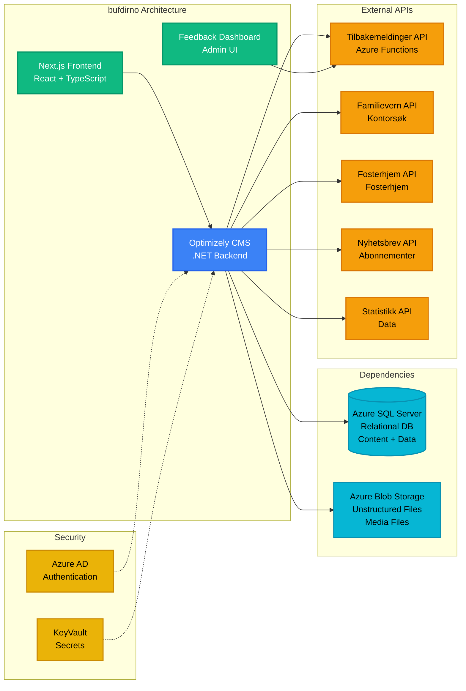

**Nøkkelkomponenter**:
- **Backend**: .NET-applikasjon med Optimizely CMS
- **Frontend**: Next.js React-applikasjon (`src/NextJs/`)
- **Database**: Azure SQL Server (relasjonsdatabase for CMS-innhold, sidedata og applikasjonsdata)
- **Blob Storage**: Azure Blob Storage (mediafiler, bilder, dokumenter)
- **Infrastructure**: Azure (KeyVault, Container Apps)
- **Authentication**: Azure AD (OAuth2 for CMS-administratortilgang og API-autentisering)

**Runtime Environment**: Azure Container App (.NET + Node.js)
- **Deployment**: Azure Pipelines (backend.yml, frontend.yml)
- **Environments**:
  - **Development/Test**: Container App `bufdirnext` (rg-ny.bufdir.no)
  - **Sandbox**: Container App `bufdirnext-sandbox` (rg-ny.bufdir.no)
  - **QA**: Container App `bufdirnext-qa` (rg-ny.bufdir.no)
  - **Production**: Container App `bufdirnext-prod` (rg-bufdirweb-prod)
- **CI/CD**: Automatisert utrulling ved branch-sammenslåing
- **Container Registry**: `crbufdirnodevtest.azurecr.io`
- **Resource Group**: rg-ny.bufdir.no (test/qa), rg-bufdirweb-prod (production)

**Development**:
- Backend: Visual Studio eller `dotnet run`
- Frontend: `npm run dev` (kjører på https://localhost:3000)
- CMS Admin: https://localhost:44320/EPiServer/Cms

**Konfigurasjon / Miljøvariabler**:

| Variabel | Beskrivelse | Kilde |
|----------|-------------|-------|
| `ConnectionStrings:EPiServerDB` | Azure SQL Server tilkoblingsstreng for CMS | KeyVault |
| `ConnectionStrings:EpiserverBlobs` | Azure Blob Storage tilkoblingsstreng | KeyVault |
| `AzureAd:TenantId` | Azure AD tenant ID | Config |
| `AzureAd:ClientId` | Azure AD applikasjons-ID | Config |
| `InternalResources:ClientSecret` | Hemmelighet for API-integrasjoner | KeyVault |
| `InternalResources:CaptchaSecretKey` | Google reCAPTCHA nøkkel | KeyVault |
| `ApplicationInsights:ConnectionString` | Application Insights for logging | KeyVault |
| `ElasticSearch:CloudId` | Elasticsearch cloud ID for søk | KeyVault |
| `ElasticSearch:ApiKey` | Elasticsearch API-nøkkel | KeyVault |
| `Statistics:ApiUrl` | URL til statistikk-API | Config |
| `FeedbackApi:Mail:SendGridKey` | SendGrid API-nøkkel for e-post | KeyVault |
| `AzureStorageQueue:ConnectionString` | Queue storage for Optimizely-hendelser | KeyVault |
| `Serilog:WriteTo:SeqSink:Args:apiKey` | Seq logging API-nøkkel | KeyVault |

**API Integrasjoner** (InternalResources:Resources):

| API | Beskrivelse | Autentisering |
|-----|-------------|---------------|
| `FamilievernKontor` | Familierådgivningskontorer API | OAuth2 scope |
| `Feedback` | Tilbakemeldinger API | Function key |
| `FostercareZip/Form/Events` | Fosterhjem API | OAuth2 scope |
| `Newsletter` | Nyhetsbrev API | Internal network |

---

### 2.2 Støttemoduler

#### 2.2.1 Family Services Application - bufdirno-fsa
**Stack**: .NET + React
**Repository**: `bufdirno-fsa/`
**Solution File**: `FSA.sln`

Applikasjon for familierådgivningskontorer (Familierådgivningskontor) og sentraladopsjonstjenester (Sentraladopsjon).

**Funksjonalitet**: Tilbyr et omfattende saksbehandlingssystem for familierådgivningskontorer og adopsjonstjenester over hele Norge. Applikasjonen gjør det mulig for sosialarbeidere og rådgivere å opprette, administrere og spore familierådgivningssaker, adopsjonssøknader og relatert dokumentasjon. Viktige funksjoner inkluderer sikre skjemainnsendinger, PDF-generering for saksrapporter og offisielle dokumenter, integrasjon med Digipost for sikker digital dokumentlevering til innbyggere, DSF/Bambus-registeroppslag for å verifisere innbyggerinformasjon, og varslingstjenester for SMS-/e-postvarsler. Systemet håndterer sensitiv personlig informasjon med strenge tilgangskontroller og revisjonslogger, og støtter hele livssyklusen til familierådgivnings- og adopsjonsprosesser fra første søknad til saksavslutning.

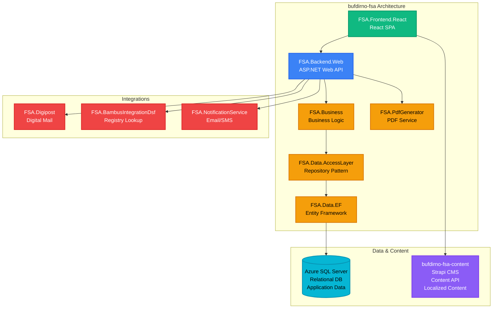

**Architecture**:
- `FSA.Backend.Web` - Web API
- `FSA.Business` - Business logic layer
- `FSA.Data.AccessLayer` - Data access layer
- `FSA.Data.EF` - Entity Framework implementation
- `FSA.Frontend.React` - React frontend
- `FSA.PdfGenerator` - PDF generation service
- `FSA.Digipost` - Digital postal integration
- `FSA.NotificationService.Connector` - Notification service integration
- `FSA.BambusIntegrationDsf.Connector` - DSF integration

**Database**: Azure SQL Server (relational database, shared with bufdirno)
- Stores FSA application data: cases, applications, user data, documents
- Entity Framework Core for data access
- Separate schema/tables from main CMS data

**Authentication**: Azure AD (OAuth2)
- User authentication for FSA application
- Role-based access control
- Integration with Azure KeyVault for secrets

**Konfigurasjon / Miljøvariabler**:

| Variabel | Beskrivelse | Kilde |
|----------|-------------|-------|
| `ConnectionStringsFSA` | SQL Server tilkoblingsstreng for FSA-data | KeyVault |
| `InternalResources:ClientId` | Azure AD klient-ID for API-integrasjoner | Config |
| `InternalResources:ClientSecret` | Azure AD hemmelighet | KeyVault |
| `InternalResources:Authority` | Azure AD authority URL | Config |
| `Apis:FrameworkContentApi` | Bufdir.no framework content API URL | Config |
| `Apis:FsaContentApi` | FSA Strapi CMS API URL | Config |
| `StrapiAPIToken` | API token for Strapi CMS | KeyVault |
| `Serilog:WriteTo:SeqSink:Args:apiKey` | Seq logging API-nøkkel | KeyVault |

**Eksterne API-integrasjoner**:

| API | Variabel | Beskrivelse |
|-----|----------|-------------|
| DSF/Bambus | `DsmApi:Url` | DSF/Bambus registerlookup API URL |
| DSF/Bambus | `DsmApi:Scopes` | OAuth2 scope for DSM API |
| Notification | `notification:Url` | Notifikasjonstjeneste URL |
| Notification | `notification:Scopes` | OAuth2 scope for notifikasjoner |
| Digipost | `EpostIntegrationAPI*` | E-postintegrasjon (endpoint, scope, login URL, client ID/secret) |

**Runtime Environment**: Azure App Service (.NET)
- **Deployment**: Azure Pipelines (azure-pipeline.yml)
- **Environments**:
  - **Development**: App Service `fsa-app-dev`
  - **QA**: App Service `fsa-app-qa`
  - **Production**: App Service `bufdir-fsa-app-prod`
  - **Feature**: App Service `fsa-app-feature` (feature branches)
- **CI/CD**: Branch-based deployment (develop → dev, release/* → QA, main → production)
- **Hosting**: Azure App Service

**Documentation**:
- `README.backenders.md` - Backend setup
- `README.frontenders.md` - Frontend setup
- `README.setup.md` - General setup

---

#### 2.2.2 FSA Content Management - bufdirno-fsa-content
**Stack**: Strapi CMS (Node.js)
**Repository**: `bufdirno-fsa-content/`
**Deployment**: Azure Container App

Headless CMS providing content to the FSA application.

**Funksjonalitet**: Administrerer alt redaksjonelt innhold for Family Services Application gjennom en headless CMS-arkitektur. Innholdsredaktører bruker Strapi admin-panelet for å opprette og vedlikeholde informasjonstekst, hjelpedokumentasjon, skjemaetiketter, veiledningsmeldinger, juridiske ansvarsfraskrivelser og prosessbeskrivelser som vises gjennom hele FSA-applikasjonen. CMS-en tilbyr strukturerte innholdstyper med versjonskontroll og flerspråklig støtte, slik at ikke-teknisk personell kan oppdatere applikasjonsinnhold uten kodeutrullinger. Innhold leveres via REST API til FSA frontend, noe som sikrer konsistent meldingsutveksling på tvers av applikasjonen og muliggjør raske innholdsoppdateringer uavhengig av applikasjonsutrullinger.

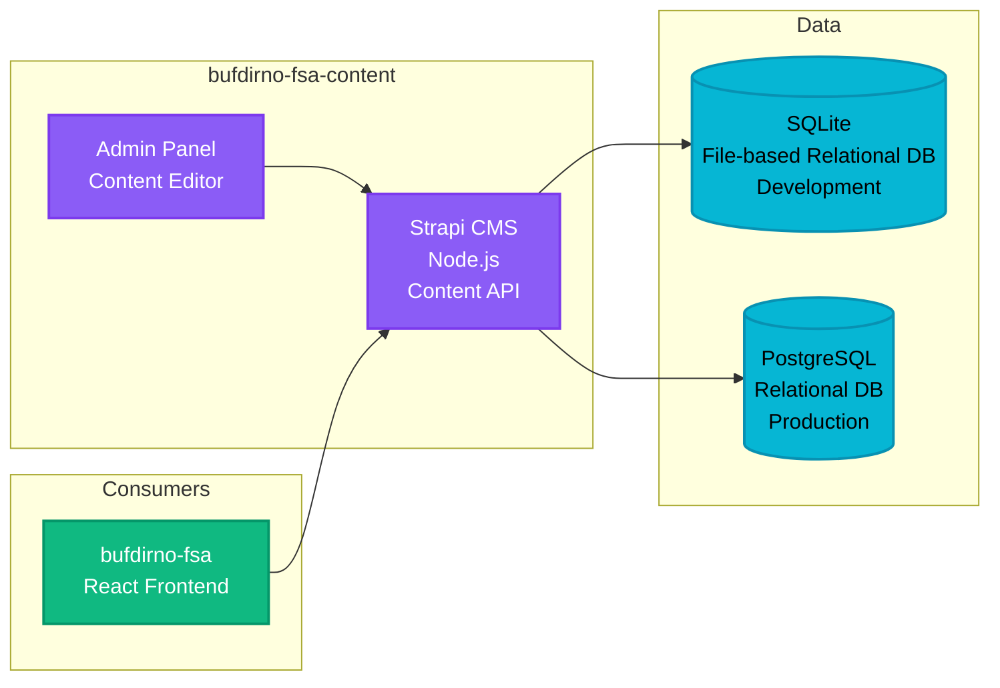

**Key Features**:
- Content types with deeply nested components
- Import/Export functionality (`export.tar.gz`)
- Multiple environment configurations (dev, test, qa, prod)
- Docker-based deployment

**Database**:
- Development: SQLite (file-based relational database, lightweight for local development)
- Production: PostgreSQL (relational database for Strapi content types and localized strings)

**Authentication**: None (content API consumed by authenticated FSA application)
- Strapi admin panel protected by Strapi's built-in authentication
- Content API accessed by FSA frontend (no additional authentication layer)

**Konfigurasjon / Miljøvariabler**:

| Variabel | Beskrivelse | Eksempel/Type | Kilde |
|----------|-------------|---------------|-------|
| `DATABASE_CLIENT` | Database type | sqlite/postgres | Config |
| `DATABASE_HOST` | PostgreSQL host | hostname | Config |
| `DATABASE_PORT` | PostgreSQL port | 5432 | Config |
| `DATABASE_NAME` | Database navn | String | Config |
| `DATABASE_USERNAME` | Database bruker | String | KeyVault |
| `DATABASE_PASSWORD` | Database passord | Secret | KeyVault |
| `DATABASE_SSL` | SSL-tilkobling enabled | true/false | Config |
| `APP_KEYS` | Strapi applikasjonsnøkler (kommaseparert) | Secret | KeyVault |
| `ADMIN_JWT_SECRET` | JWT secret for admin-panel | Secret | KeyVault |
| `API_TOKEN_SALT` | Salt for API tokens | Secret | KeyVault |
| `JWT_SECRET` | JWT secret for autentisering | Secret | KeyVault |
| `TRANSFER_TOKEN_SALT` | Salt for transfer tokens | Secret | KeyVault |

**Runtime Environment**: Azure Container App (Node.js)
- **Deployment**: Azure Pipelines (azure-pipeline.yml) + Docker
- **Environments**: Test (develop), QA (release/*), Production (main)
- **Azure Resources**:
  - Container Apps use variable groups: `fsa-content-test`, `fsa-content-qa`, `fsa-content-prod`
  - Resource names configured per environment in pipeline variable groups
- **CI/CD**: Docker image build and push to Azure Container Registry
- **Hosting**: Azure Container App with environment-specific Dockerfiles (Dockerfile-dev, -test, -qa, -prod)
- **Docker Compose**: Available for local development

**Development**:
```bash
npm install
npm run develop
npm run import  # Import content from export.tar.gz
```

---

#### 2.2.3 Familievern API - bufdirno-familievern-api
**Stack**: .NET API
**Repository**: `bufdirno-familievern-api/`

API for søk etter familierådgivningskontorer.

**Funksjonalitet**: Tilbyr en lettvekts søke- og informasjonstjeneste for å finne familierådgivningskontorer (familierådgivningskontorer) over hele Norge. API-et parser kontordata fra Excel-regneark lagret i Azure Blob Storage, og opprettholder en in-memory cache for raske oppslag. Innbyggere kan søke etter postnummer, kommune eller region for å finne nærmeste familierådgivningskontor, inkludert kontaktinformasjon, adresser og åpningstider. API-et administrerer også informasjon om rådgivningskurs og programmer som tilbys på forskjellige steder. Denne mikrotjenesten konsumeres av hovedportalen bufdirno for å vise interaktive kontorlokalisatorer og tjenestekatalog, slik at innbyggere raskt kan få tilgang til lokale familierådgivningstjenester.

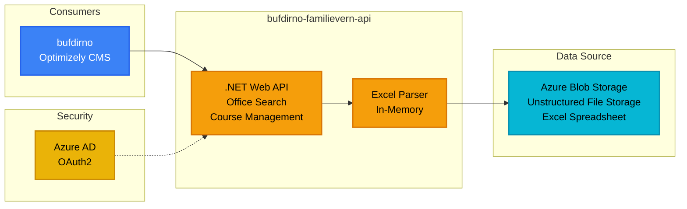

**Data Source**: Azure Blob Storage - Excel spreadsheet (stbufdirweb > bufdirfamilievernexceltest)
- Type: Unstructured file storage
- Format: Excel (.xlsx) containing office locations, contact information, and metadata
- Access: In-memory parsing for fast lookups

**Authentication**: Azure AD OAuth2
- Scope: `api://b9a288ae-6cf4-4b65-ac97-1b3ee9d4542e/.default`
- Service Principal authentication
- Consumed by bufdirno with delegated permissions

**Key Features**:
- In-memory parsing of Excel spreadsheet
- Office search functionality
- Swagger UI for API documentation

**Dependencies**:
- Azurite (Azure Storage Emulator)

**Konfigurasjon / Miljøvariabler**:
- `AzureKeyVaultEnabled` - Aktiverer Azure KeyVault (true/false)
- `AzureKeyVaultName` - KeyVault navn (kv-familievernapi)
- `RequireAuthentication` - Krever autentisering (true/false)
- `Excel:ConnectionString` - Azure Blob Storage tilkoblingsstreng
- `Excel:ContainerName` - Blob container navn (bufdirfamilievernexceltest)
- `Excel:FileName` - Excel filnavn (masterdata.xlsx)
- `AzureAd:Instance` - Azure AD instance URL
- `AzureAd:TenantId` - Azure AD tenant ID
- `AzureAd:ClientId` - Azure AD applikasjons-ID
- `Mail:SendgridKey` - SendGrid API-nøkkel for e-postvarslinger
- `Mail:SenderEmail` - Avsender e-postadresse
- `Recipients:ValidPostfixes` - Gyldige e-postdomener (bufdir.no, bufetat.no)

**Runtime Environment**: Azure App Service (.NET)
- **Deployment**: Azure Pipelines (azure-pipelines.yml)
- **Environments**:
  - **Development**: App Service `familievernApi`
  - **QA**: App Service `familievern-qa`
  - **Production**: App Service `familievern`
- **CI/CD**: Automated deployment on branch merges
- **Hosting**: Azure App Service
- **Production URL**: https://familievern.azurewebsites.net

**Development**:
```bash
npm install -g azurite
azurite  # Run in terminal
```

---

#### 2.2.4 Tilbakemeldinger API - bufdirno-feedback-api
**Stack**: .NET Azure Functions
**Repository**: `bufdirno-feedback-api/`
**Deployment**: Azure Functions

Mikrotjeneste for mottak av brukertilbakemeldinger fra Bufdir.no ("fant du det du lette etter").

**Funksjonalitet**: Samler inn og administrerer tilbakemeldinger fra brukere gjennom en serverløs arkitektur for å måle innholdets effektivitet og brukertilfredshet på Bufdir.no. Systemet fanger opp "Fant du det du lette etter?"-svar sammen med valgfrie kommentarer fra nettstedbesøkende, og lagrer tilbakemeldinger med metadata som side-URL, tidsstempel og brukervurderinger. Funksjoner inkluderer HTTP-endepunkter for å sende inn tilbakemeldinger, spørre etter tilbakemeldingsstatistikk og generere rapporter. E-postvarsler sendes til innholdsansvarlige via SendGrid når negativ tilbakemelding mottas, noe som muliggjør rask respons på innholdsproblemer. Et administrativt dashbord gir analyser og trenddata for å hjelpe innholdsteam med å identifisere problematiske sider og forbedre informasjonstilgjengelighet. Den serverløse designen sikrer kostnadseffektiv skalering under trafikk-topper samtidig som responstidene holdes under ett sekund.

**Konfigurasjon / Miljøvariabler**:
- `ConnectionStrings:Default` (eller `SQLCONNSTR_Default`, `SQLAZURECONNSTR_Default`) - SQL Server tilkoblingsstreng for feedback-data
- `Mail:SendgridKey` - SendGrid API-nøkkel for e-postvarsler
- `Mail:Recipients` - Liste over e-postmottakere for tilbakemeldingsvarsler
- `Mail:SenderName` - Avsendernavn for e-postvarsler
- `Mail:SenderEmail` - Avsender e-postadresse
- `Mail:Subject` - E-postemnelinje for tilbakemeldingsvarsler

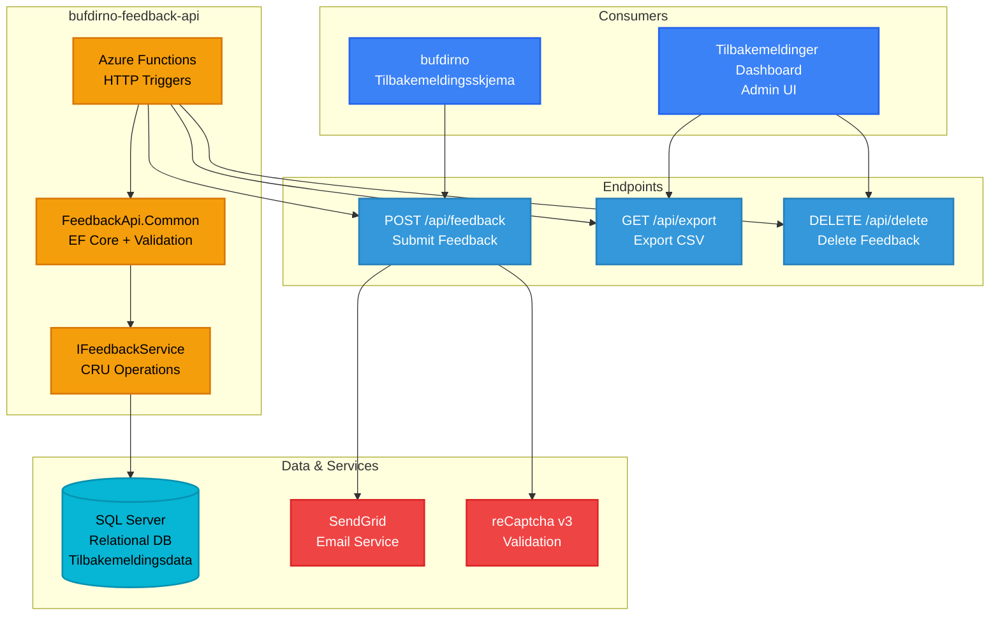

**Projects**:
- `FeedbackApi.Common` - Data access layer (EF Core), validation, and `IFeedbackService`
- `FeedbackApi.Function` - Azure Function with HTTP triggers
- `FeedbackApi.Tests` - Unit tests

**Endpoints**:
- `[POST] api/feedback` - Submit user feedback, sends email on negative feedback
- `[GET] api/export/{pageId:int?}` - Export feedback as CSV

**Key Features**:
- reCaptcha v3 protection
- SendGrid email integration for negative feedback
- EF Core for database access
- CSV export functionality

**Database**: SQL Server (relational database)
- Stores user feedback submissions (positive/negative, comments, page metadata)
- Tables managed via Entity Framework Core migrations
- Supports CSV export for analytics

**Authentication**: Azure Function Keys
- Submit endpoint: Function-level key (public access with reCaptcha protection)
- Export endpoint: Function-level key (admin access)
- Delete endpoint: Function-level key (admin access, protected)
- Admin dashboard: Role-based access (`FeedbackUser`, `FeedbackAdmin` roles)

**Runtime Environment**: Azure Functions (Consumption Plan)
- **Deployment**: Azure Pipelines (azure-pipelines.yml)
- **Environments**:
  - **Development**: Function App `bufdirnoFeedbackApi`
  - **QA**: Function App `bufdirnoQaFeedbackApi`
  - **Production**: Function App `bufdirnoProdFeedbackApi`
- **CI/CD**: Automated deployment via Azure Functions deployment task
- **Hosting**: Azure Functions (serverless, event-driven)
- **Production URL**: https://bufdirnoprodfeedbackapi.azurewebsites.net
- **Trigger Type**: HTTP triggers

**Development**:
```bash
dotnet tool install --global dotnet-ef
dotnet ef database update  # Run in FeedbackApi.Common directory
```

---

#### 2.2.5 Fosterhjem API - bufdirno-fosterhjem-api
**Stack**: .NET API
**Repository**: `bufdirno-fosterhjem-api/`
**Solution File**: `BufDirNoApi.sln`

API for fosterhjemstjenester.

**Funksjonalitet**: Administrerer informasjon og arrangementer knyttet til fosterhjemstjenester (fosterhjem) i Norge, og støtter både offentlig informasjonsspredning og skjemainnsending. API-et tilbyr endepunkter for søk etter fosterhjemskontorer etter postnummer, henting av informasjon om fosterhjemsprogrammer og krav, administrering av arrangementsoversikter for opplæring av fosterforeldre og informasjonsmøter, og behandling av innkommende skjemaer fra potensielle fosterforeldre. Tjenesten følger Clean Architecture-prinsipper med separate lag for API-kontrollere, kjerneforretningslogikk og datatilgang via Entity Framework Core. Integrasjon med Azure AD OAuth2 sikrer sikker tilgang når den kalles fra bufdirno-portalen, mens Azure KeyVault administrerer sensitiv konfigurasjonsdata. API-et støtter hele informasjonsflyten for fosterhjem fra første henvendelse til formell søknadsinnsending.

**Konfigurasjon / Miljøvariabler**:
- `AzureKeyVaultEnabled` - Aktiverer Azure KeyVault (true/false)
- `AzureKeyVaultName` - KeyVault navn (kv-bufdirno-test, kv-bufdirno-prod, etc.)
- `ConnectionStrings:dbCon` - SQL Server tilkoblingsstreng for fosterhjem-data
- `UseInMemoryDatabase` - Bruker in-memory database for testing (true/false)
- `Require_Authentication` - Krever Azure AD autentisering (true/false)
- `SwaggerEnabled` - Aktiverer Swagger API-dokumentasjon (true/false)
- `AzureAd:Instance` - Azure AD instance URL
- `AzureAd:ClientId` - Azure AD applikasjons-ID
- `AzureAd:TenantId` - Azure AD tenant ID
- `AzureAd:TokenValidationParameters:ValidAudiences` - Gyldige API audience-verdier
- `AuthorizationUrl` - Azure AD OAuth2 authorization URL
- `TokenUrl` - Azure AD OAuth2 token URL
- `ApiScope` - OAuth2 API scope for autentisering
- **Eksterne API-integrasjoner**:
  - `RosApiBaseUrl` - ROS (Bufetat) API base URL (regioner 2-6)
  - `RosApiKey` - API-nøkkel for ROS-integrasjon
  - `Oslo:BaseAddress` - Oslo Kommune API base URL (region 8)
  - `Oslo:ApiKey` - API-nøkkel for Oslo-integrasjon
- **Klient Konfigurasjon** (`ClientConfigurations` array):
  - `AppId` - Azure AD App ID for klientsystem
  - `Name` - Klientnavn (Ros, Oslo)
  - `SystemId` - Unikt system-ID (1=ROS, 2=Oslo)
  - `EnableNewFormHandling` - Aktiverer ny skjemabehandling
  - `RegionIds` - Liste over regionIDer systemet håndterer

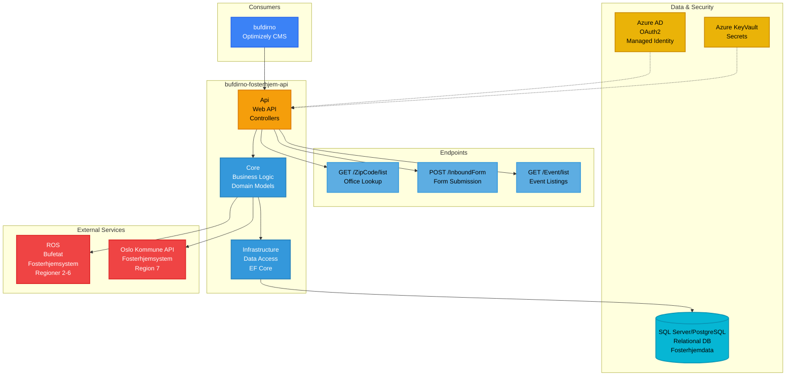

**Projects**:
- `Api` - Web API project
- `Core` - Core business logic
- `Infrastructure` - Data access and infrastructure
- `Tests` - Test projects

**Database**: SQL Server or PostgreSQL (relational database)
- Stores foster home data, events, office information, and form submissions
- Managed via Entity Framework Core
- Clean Architecture pattern with Infrastructure layer for data access

**External Services Integration**:
- **ROS (Rekruttering og Oppfølging av Statlige fosterhjem)**: Bufetat's foster home system at https://ros.bufetat.no. Se [detaljert dokumentasjon av ROS-integrasjonen](./ros-integrasjon.md).
  - Handles regions 2-6 (state-managed foster homes)
  - Provides area/region lookups via `/api/Area/list`
  - Form submission endpoint (currently disabled - returns HTTP 410)
- **Oslo Kommune API**: Oslo municipality's foster home system at https://fosterhjem.api.oslo.kommune.no
  - Handles region 7 (Oslo municipality)
  - Separate API key authentication
  - Independent form handling for Oslo region

**Authentication**: Azure AD OAuth2 + Managed Identity
- Scope: `api://0c4c1255-4646-46bb-a5ca-35f06fdf14fe/.default`
- Managed Identity for Azure deployment (service-to-service authentication)
- Service Principal for local development
- Consumed by bufdirno with delegated permissions

**Configuration**:

| Komponent | Beskrivelse |
|-----------|-------------|
| Azure KeyVault integration | Kan deaktiveres for lokal utvikling |
| Managed Identity | Support for Azure deployment (service-to-service autentisering) |
| Multi-system client | Konfigurering for ROS og Oslo-systemer |

**Database Setup**:
```bash
dotnet tool restore
dotnet ef database update -p .\Infrastructure\Infrastructure.csproj -s .\Api\Api.csproj
```

**Environment Variables** (local development):

| Variabel | Beskrivelse | Type |
|----------|-------------|------|
| `AzureKeyVaultEnabled` | Aktivér/deaktivér KeyVault | true/false |
| `AzureKeyVaultName` | KeyVault navn | String |
| `AZURE_CLIENT_ID` | App registration med KeyVault-tilgang | GUID |
| `AZURE_TENANT_ID` | Tenant ID | GUID |
| `AZURE_CLIENT_SECRET` | Client secret | Secret |

**Runtime Environment**: Azure Container App (.NET)
- **Deployment**: Azure Pipelines (azure-pipelines.yml) + Docker
- **Environments**:
  - **Test**: Container App `ca-fosterhjem-api-test`
  - **QA**: Container App `ca-fosterhjem-api-qa`
  - **Production**: Container App `ca-fosterhjem-api-prod`
- **URLs**:
  - Test: https://ca-fosterhjem-api-test.mangomushroom-fdb9af6c.norwayeast.azurecontainerapps.io
  - QA: https://ca-fosterhjem-api-qa.politecliff-01597c12.norwayeast.azurecontainerapps.io
  - Production: https://ca-fosterhjem-api-prod.bluemoss-72d501a7.norwayeast.azurecontainerapps.io
- **CI/CD**: Docker build with NuGet authentication, push to ACR, deploy to Container App
- **Hosting**: Azure Container App
- **Build**: Multi-stage Docker build with KeyVault integration

---

#### 2.2.6 Nyhetsbrev API - bufdirno-newsletter-api
**Stack**: .NET API
**Repository**: `bufdirno-newsletter-api/`
**Solution File**: `Bufdir.Newsletter.API.sln` (in src/)

API for nyhetsbrevabonnementer og administrasjon.

**Funksjonalitet**: Håndterer e-postnyhetsbrevabonnementer og preferanseadministrasjon for Bufdir.no-kommunikasjon gjennom integrasjon med Dialog API (Make-tjenesten). API-et tilbyr REST-endepunkter for brukere til å abonnere på ulike nyhetsbrevtemaer (barnevernoppdateringer, fosterhjemsinformasjon, nyheter om familietjenester osv.), administrere abonnementspreferanser og melde seg av e-postlister. Tjenesten fungerer som et integrasjonslag og proxyer forespørsler til Dialog/Make API på subscribers.dialogapi.no, som administrerer de faktiske abonnentdataene, e-postlister og e-postlevering. Utplassert på et internt Azure Container App-nettverk, nås API-et eksklusivt av bufdirno-portalen, noe som gir sikkerhet på nettverksnivå uten å kreve OAuth2-autentisering.

**Konfigurasjon / Miljøvariabler**:
- `Services:ActiveService` - Aktivt tjeneste-navn (Make)
- `Services:Make:BaseUrl` - Dialog API base URL (https://subscribers.dialogapi.no)
- `Services:Make:HttpClientName` - HTTP klient navn for dependency injection
- `Services:Make:ApiKey` - API-nøkkel for Dialog/Make autentisering
- `Services:Make:UserId` - Bruker-ID for Dialog/Make API
- `AzureAd:Instance` - Azure AD instance URL (kun for eventuell fremtidig autentisering)
- `AzureAd:ClientId` - Azure AD applikasjons-ID
- `AzureAd:TenantId` - Azure AD tenant ID

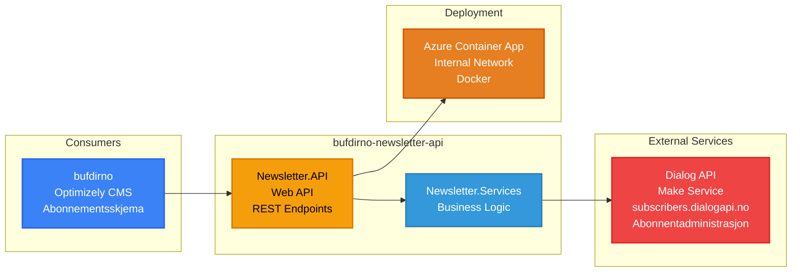

**Projects**:
- `Bufdir.Newsletter.API` - Web API
- `Bufdir.Newsletter.Services` - Service layer

**Database**: None (uses external API)
- No local database - acts as integration layer/proxy
- Integrates with Dialog API (Make service) at https://subscribers.dialogapi.no
- Dialog API endpoints:
  - POST `/api/public/v2/subscribers` - Create subscriber
  - GET `/api/public/v2/subscriberlists/{id}` - Get mailing list info
  - GET `/api/public/v2/subscriberlists/` - List all mailing lists
- All subscriber data stored and managed by Dialog/Make service

**Authentication**: None (internal network only)
- Deployed on internal Azure Container App network
- No OAuth2 scopes configured
- Accessed only by bufdirno within Azure internal network
- Network-level isolation provides security

**Runtime Environment**: Azure Container App (.NET)
- **Deployment**: Azure Pipelines (azure-pipelines.yml) + Docker
- **Environments**:
  - **Test**: Container App `ca-newsletter-api`
  - **QA**: Container App `ca-newsletter-api-qa`
  - **Production**: Container App `ca-newsletter-api-prod`
- **URLs** (internal only):
  - Test: https://ca-newsletter-api.internal.mangomushroom-fdb9af6c.norwayeast.azurecontainerapps.io
  - QA: https://ca-newsletter-api-qa.internal.politecliff-01597c12.norwayeast.azurecontainerapps.io
  - Production: https://ca-newsletter-api-prod.internal.bluemoss-72d501a7.norwayeast.azurecontainerapps.io
- **CI/CD**: Docker build with NuGet PAT, push to ACR, deploy to Container App
- **Hosting**: Azure Container App (internal network)
- **Network**: Internal-only, not exposed to public internet
- **Branches**: develop, release/*, main, hotfix/*

---

#### 2.2.7 Statistikk & Data API - stat-backend
**Stack**: .NET 6.0
**Repository**: `stat-backend/`
**Solution File**: `BufdirStatistics.sln`

Modulær statistikk-API som leverer data til diverse Bufdir-tjenester.

**Funksjonalitet**: Leverer statistiske data og analyser gjennom en modulær API-arkitektur som støtter flere spesialiserte tjenester. Systemet består av to hovedmoduler: MunStat (Kommunemonitor) som gir statistikk på kommunenivå og dashboards for lokalmyndigheters overvåking av barnevernsstatistikk, og Statistics-modulen som leverer generell statistisk data for innholdsblokker på Bufdir.no. API-et aggregerer data fra Cosmos DB (MongoDB API) som inneholder tidsseriestatistikk, saksnumre, demografiske opplysninger og trendanalyser. Integrasjon med stat-content-strapi5 gir konfigurerbare datavisualiseringer, diagramdefinisjoner og visningsparametere. Den modulære arkitekturen tillater uavhengig utrulling og skalering av statistikktjenester, med hver modul hostet på separate Azure App Services. Systemet støtter komplekse spørringer, dataaggregering og caching for høy-ytende levering av statistisk innsikt til dashboards og offentlige informasjonssider.

**Konfigurasjon / Miljøvariabler**:

**Azure AD Konfigurasjon**:

| Variabel | Beskrivelse | Kilde |
|----------|-------------|-------|
| `AzureAd:Instance` | Azure AD instance URL | Config |
| `AzureAd:ClientId` | Azure AD applikasjons-ID | Config |
| `AzureAd:TenantId` | Azure AD tenant ID | Config |
| `AzureAd:Domain` | Azure AD domene | Config |

**Generell Konfigurasjon**:

| Variabel | Beskrivelse | Eksempel |
|----------|-------------|----------|
| `ASPNETCORE_ENVIRONMENT` | Miljøtype | LocalDevelopment, Development, Production |
| `APPLICATIONINSIGHTS_CONNECTION_STRING` | Application Insights tilkoblingsstreng | KeyVault |

**MongoDB / Cosmos DB Konfigurasjon** (`MongoDb` section):

| Variabel | Beskrivelse | Kilde |
|----------|-------------|-------|
| `MongoDb:ConnectionString` | Direkte tilkoblingsstreng (prioriteres hvis satt) | KeyVault |
| `MongoDb:Secret` | Navn på KeyVault-hemmelighet for connection string | Config |
| `MongoDb:Host` | MongoDB/Cosmos DB host | Config |
| `MongoDb:Port` | MongoDB/Cosmos DB port | Config |
| `MongoDb:Username` | Database brukernavn | Config |
| `MongoDb:Password` | Database passord | KeyVault |

**Azure Konfigurasjon** (`Azure` section):

| Variabel | Beskrivelse | Kilde |
|----------|-------------|-------|
| `Azure:KeyVaultName` | Azure KeyVault navn for secrets | Config |
| `Azure:TenantId` | Azure tenant ID for KeyVault tilgang | Config |

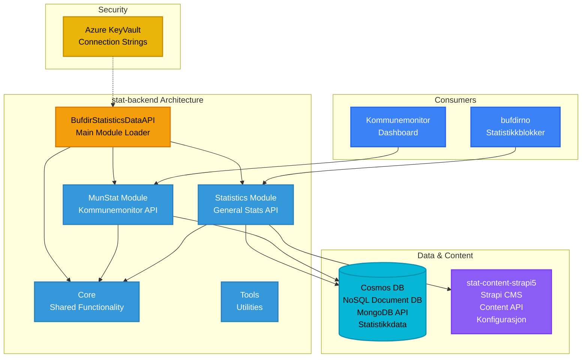

**Modules**:
- `MunStat` - Municipal monitor API (Kommunemonitor)
- `Statistics` - General statistics API for Strapi blocks
- `Core` - Shared functionality
- `BufdirStatisticsDataAPI` - Main runnable module
- `Tools` - Utility tools

**Database**: Azure Cosmos DB with MongoDB API (NoSQL document database)
- Stores statistical data, time-series data, and aggregated metrics
- MongoDB-compatible API for flexible schema and high-performance queries
- Optimized for read-heavy workloads (statistics dashboards and reports)
- Scalable for large datasets

**Authentication**: Azure KeyVault + IP Whitelisting
- Cosmos DB connection string stored in Azure KeyVault
- IP-based access control for development environments
- Contributor role required for accessing cosmos-mongo-stat-api-dev
- No OAuth2 for API endpoints (public statistics data)

**Prerequisites**:
- Azure tenant membership (Fantomet)
- Contributor access to cosmos-mongo-stat-api-dev
- IP whitelisting
- Environment variable: `ASPNETCORE_ENVIRONMENT = Development`

**Runtime Environment**: Azure App Service (.NET 6.0)
- **Deployment**: Azure Pipelines (azure-pipelines.yml)
- **Environments**:
  - **Development**: App Service `app-stat-api-dev` (Statistics), `app-stat-monitor-api-dev` (MunStat)
  - **QA**: App Service `app-stat-api-qa` (Statistics), `app-stat-monitor-api-qa` (MunStat)
  - **Production**: App Service `app-stat-api` (Statistics), `app-stat-monitor-api` (MunStat)
- **CI/CD**: Standard .NET deployment to Azure App Service
- **Hosting**: Azure App Service (separate services for each module)
- **Production URL**: https://statistikk.bufdir.no
- **Modular Architecture**: Independently deployable API modules (MunStat, Statistics)

**Documentation**: https://bufdir.atlassian.net/wiki/spaces/BUF/pages/2295365637/Ny+statistikkmodul

---

#### 2.2.8 Statistikk Innholdsadministrasjon - stat-content-strapi5
**Stack**: Strapi 5 (Node.js + TypeScript)
**Repository**: `stat-content-strapi5/`
**Deployment**: Azure Container App

Headless CMS som leverer innhold og konfigurasjon for statistikkvisninger.

**Funksjonalitet**: Administrerer konfigurasjon og metadata for statistiske datavisualiseringer gjennom en Strapi 5 headless CMS. Innholdsredaktører bruker admin-panelet for å definere statistikkblokkonfigurasjoner inkludert diagramtyper (stolpe, linje, kakediagram), datakilde-koblinger, filtreringsparametere, visningstitler, akseetiketter, fargevalg og verktøytipsformater. CMS-en lagrer strukturerte innholdstyper som styrer hvordan statistisk data fra stat-backend presenteres på Bufdir.no og Kommunemonitor-dashboards. Tilpassede skript for hemmelighetsadministrasjon håndterer sikker konfigurasjon av API-endepunkter og legitimasjon. Systemet støtter multi-miljøkonfigurasjoner med separate innstillinger for development, test, QA og production, noe som tillater at statistikkvisninger kan konfigureres og forhåndsvises før publisering. Denne separasjonen av data (stat-backend) fra presentasjonskonfigurasjon (stat-content-strapi5) gjør det mulig for ikke-teknisk personell å oppdatere diagramutseende og dashboard-layouts uten utviklerinngrep.

**Konfigurasjon / Miljøvariabler**:

**Server Konfigurasjon**:

| Variabel | Beskrivelse | Eksempel | Kilde |
|----------|-------------|----------|-------|
| `HOST` | Server host adresse | 0.0.0.0 | Config |
| `PORT` | Server port | 1337 | Config |

**Strapi Secrets**:

| Variabel | Beskrivelse | Kilde |
|----------|-------------|-------|
| `APP_KEYS` | Strapi applikasjonsnøkler (kommaseparert) | KeyVault |
| `API_TOKEN_SALT` | Salt for API tokens | KeyVault |
| `ADMIN_JWT_SECRET` | JWT secret for admin-panel autentisering | KeyVault |
| `TRANSFER_TOKEN_SALT` | Salt for transfer tokens | KeyVault |
| `JWT_SECRET` | JWT secret for generell autentisering | KeyVault |
| `STATISTICS_API_TOKEN` | API token for statistikk-API integrasjon | KeyVault |
| `ENCRYPTION_KEY` | Krypteringsnøkkel for sensitive data | KeyVault |

**Database Konfigurasjon**:

| Variabel | Beskrivelse | Eksempel | Kilde |
|----------|-------------|----------|-------|
| `DATABASE_CLIENT` | Database type | mysql, sqlite, postgres | Config |
| `DATABASE_FILENAME` | Filnavn for SQLite database | String | Config |
| `DATABASE_HOST` | Database server host | hostname | Config |
| `DATABASE_PORT` | Database server port | 3306/5432 | Config |
| `DATABASE_NAME` | Database navn | String | Config |
| `DATABASE_USERNAME` | Database brukernavn | String | KeyVault |
| `DATABASE_PASSWORD` | Database passord | Secret | KeyVault |
| `DATABASE_SSL` | SSL-tilkobling enabled | true/false | Config |
| `DATABASE_SSL_REJECT_UNAUTHORIZED` | Reject unauthorized SSL | true/false | Config |

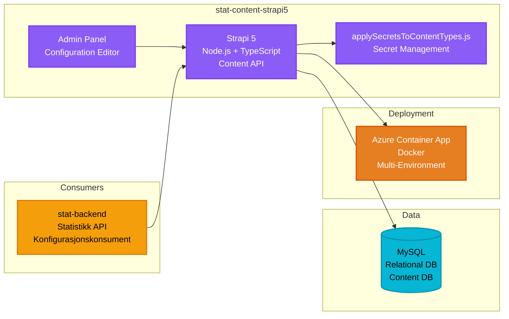

**Database**: MySQL (relational database)
- Stores Strapi content types, configurations, and metadata
- Contains statistics block definitions, data source mappings, and display settings
- Relational structure for complex content relationships

**Authentication**: None (content API consumed by stat-backend)
- Strapi admin panel protected by Strapi's built-in authentication
- Content API accessed by stat-backend without additional authentication
- Custom secret management via `applySecretsToContentTypes.js`

**Key Features**:
- Multiple environment configurations (.env-dev, .env-test, .env-qa, .env-prod)
- Custom secret management (`applySecretsToContentTypes.js`)
- Docker-based deployment with environment-specific Dockerfiles

**Runtime Environment**: Azure Container App (Node.js + TypeScript)
- **Deployment**: Azure Pipelines (azure-pipeline.yml) + Docker
- **Environments**:
  - Uses variable groups: `stat-content5-test`, `stat-content5-qa`, `stat-content5-prod`
  - Resource names configured per environment in variable groups
- **Reference URL**: https://ca-stat-content-strapi5.greenmushroom-dba12d86.norwayeast.azurecontainerapps.io/api (sandbox)
- **CI/CD**: Docker image build, push to ACR, deploy to Container App with FQDN retrieval
- **Hosting**: Azure Container App
- **Docker Compose**: Available for local development
- **Environment-Specific**: Separate Dockerfiles per environment (dev, test, qa, prod)

**Development**:
```bash
npm install
npm run develop
```

---

#### 2.2.9 Utrapporteringsbank - utrapporteringsbank
**Stack**: Next.js (TypeScript)
**Repository**: `utrapporteringsbank/`

Rapporteringsapplikasjon bygget med Next.js.

**Funksjonalitet**: Tilbyr et sikkert rapporteringssystem for autoriserte brukere til å sende inn og administrere institusjonelle rapporter relatert til barnevern og familietjenester. Applikasjonen bruker ID-porten for sterk autentisering via norske nasjonale eID-tjenester (BankID, MinID), noe som sikrer at bare autorisert personell kan få tilgang til rapporteringsgrensesnittet. Brukere kan opprette, redigere og sende inn strukturerte rapporter med skjemavalidering og datapersistens håndtert gjennom Drizzle ORM med PostgreSQL. Systemet opprettholder omfattende revisjonslogger over rapportinnsendinger, endringer og tilgangsmønstre for etterlevelse og ansvarlighet. Next.js server-side rendering sikrer optimal ytelse samtidig som sensitiv data håndteres sikkert, med SSL-krypterte databasetilkoblinger til Azure Database for PostgreSQL. Rapporteringsarbeidsflyten støtter utkastlagring, gjennomgangsprosesser og endelig innsending med bekreftelsesmeldinger.

**Konfigurasjon / Miljøvariabler**:

**Database Konfigurasjon**:

| Variabel | Beskrivelse | Kilde |
|----------|-------------|-------|
| `DB_HOST` | PostgreSQL server host | Config |
| `DB_PORT` | PostgreSQL server port | Config |
| `DB_USER` | Database brukernavn | KeyVault |
| `DB_PASSWORD` | Database passord | KeyVault |
| `DB_NAME` | Database navn | Config |

**ID-porten Autentisering** (Norsk eID):

| Variabel | Beskrivelse | Kilde |
|----------|-------------|-------|
| `NEXT_PUBLIC_IDPORTEN_WELLKNOWN_URL` | ID-porten OpenID Connect discovery URL | Config |
| `NEXT_PUBLIC_IDPORTEN_LOGOUT_URL` | ID-porten logout URL | Config |
| `IDPORTEN_CLIENT_ID` | ID-porten klient-ID for OAuth2 | Config |
| `IDPORTEN_CLIENT_SECRET` | ID-porten klient-hemmelighet | KeyVault |

**Azure AD Autentisering** (Internt personell):

| Variabel | Beskrivelse | Kilde |
|----------|-------------|-------|
| `AZURE_CLIENT_ID` | Azure AD applikasjons-ID | Config |
| `AZURE_CLIENT_SECRET` | Azure AD hemmelighet | KeyVault |
| `AZURE_TENANT_ID` | Azure AD tenant ID | Config |

**NextAuth Konfigurasjon**:

| Variabel | Beskrivelse | Kilde |
|----------|-------------|-------|
| `NEXTAUTH_URL` | NextAuth callback URL | Config |
| `NEXTAUTH_SECRET` | NextAuth session krypteringsnøkkel | KeyVault |

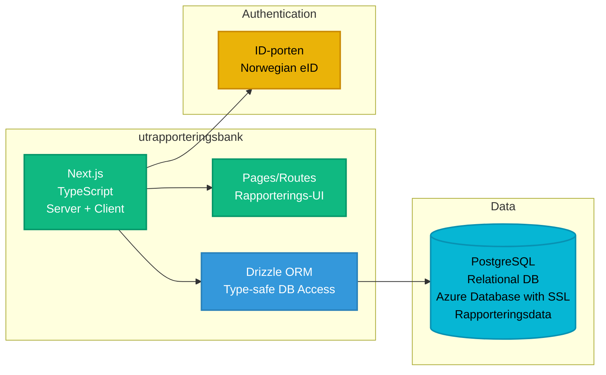

**Database**: PostgreSQL (Azure Database for PostgreSQL with SSL)

**Authentication**: ID-porten (Norwegian national eID service)
- OAuth2/OpenID Connect integration
- Production: `https://idporten.no/.well-known/openid-configuration`
- Test: `https://test.idporten.no/.well-known/openid-configuration`
- Used for Norwegian citizen authentication (BankID, MinID, etc.)
- Provides secure user identity verification

**Runtime Environment**: Azure Container App or Azure App Service (Node.js)
- **Deployment**: Azure Pipelines (azure-pipelines.yml)
- **Environments**: Development, Test, QA, Production
  - Azure resource names configured in pipeline
- **CI/CD**: Next.js build and deployment
- **Hosting**: Likely Azure Container App or Azure App Service
- **Port**: 6000 (development)
- **Framework**: Next.js (Server-Side Rendering + API Routes)

**Development**:
```bash
npm run dev  # Runs on http://localhost:6000
```

**Key Technologies**:
- Next.js
- Drizzle ORM (`drizzle.config.ts`) - Type-safe PostgreSQL access
- TypeScript
- ID-porten integration

---

## 3. Secrets og Utløpsdatoer

Løsningen bruker flere typer Secrets som har utløpsdatoer eller må roteres regelmessig. Dette kapittelet dokumenterer hvilke Secrets som krever oppfølging.

### 3.1 Azure AD Client Secrets ⏰

**Lokasjon**: Alle moduler som bruker Azure AD OAuth2
- **bufdirno**: `InternalResources:ClientSecret`
- **bufdirno-fsa**: `InternalResources:ClientSecret`
- **bufdirno-fosterhjem-api**: Azure AD konfigurasjon
- **stat-backend**: `AzureAd:ClientSecret`
- **utrapporteringsbank**: `AZURE_CLIENT_SECRET`

**Utløp**: Azure AD Client Secrets utløper typisk etter **24 måneder (2 år)** som standard, men kan konfigureres for kortere perioder (6 måneder, 12 måneder)

**Konsekvens ved utløp**: API-autentisering feiler, integrasjoner mellom tjenester bryter sammen

**Anbefaling**: Sett kalendervarslinger 1-2 måneder før 24-måneders utløp

---

### 3.2 ID-porten Client Secrets ⏰

**Lokasjon**: utrapporteringsbank
- `IDPORTEN_CLIENT_SECRET`

**Utløp**: ID-porten client secrets må roteres periodisk basert på DigDir sine sikkerhetskrav

**Konsekvens ved utløp**: Innbyggerautentisering via BankID/MinID feiler

**Anbefaling**: Sjekk DigDir-portalen for utløpsdatoer og roter i god tid

---

### 3.3 API-nøkler

#### 3.3.1 SendGrid API Keys ⏰

**Lokasjon**:
- **bufdirno**: `FeedbackApi:Mail:SendGridKey`
- **bufdirno-familievern-api**: `Mail:SendgridKey`
- **bufdirno-feedback-api**: `Mail:SendgridKey`

**Utløp**: SendGrid API-nøkler utløper ikke automatisk, men bør roteres regelmessig av sikkerhetshensyn

**Konsekvens ved feil**: E-postvarsler feiler (tilbakemeldinger, kurspåmeldinger, etc.)

**Anbefaling**: Roter årlig

---

#### 3.3.2 Dialog/Make API Keys ⏰

**Lokasjon**: bufdirno-newsletter-api
- `Services:Make:ApiKey`
- `Services:Make:UserId`

**Utløp**: Leverandøravhengig, krever koordinering med Dialog/Make

**Konsekvens ved feil**: Nyhetsbrevabonnementsfunksjonalitet slutter å virke

**Anbefaling**: Koordiner med leverandør om utløpspolicy

---

#### 3.3.3 ROS & Oslo Kommune API Keys ⏰

**Lokasjon**: bufdirno-fosterhjem-api
- `RosApiKey` - Bufetat ROS-system (regioner 2-6)
- `Oslo:ApiKey` - Oslo kommune system (region 8)

**Utløp**: Offentlige system-API-nøkler kan ha utløpspolicyer

**Konsekvens ved feil**: Innsending av fosterhjemskjemaer feiler for spesifikke regioner

**Anbefaling**: Koordiner med Bufetat og Oslo kommune om nøkkelrotasjon

---

### 3.4 SSL/TLS Sertifikater ⏰

**Lokasjon**: Alle Azure-tjenester med egendefinerte domener
- Azure Container Apps
- Azure App Services
- Azure Functions

**Utløp**: Typisk **12 måneder** for sertifikater

**Konsekvens ved utløp**: HTTPS-tilkoblinger feiler, tjenester blir utilgjengelige

**Anbefaling**: Aktiver auto-fornyelse i Azure Portal hvor mulig, overvåk sertifikatutløp

---

### 3.5 Strapi Secrets ⚠️

**Lokasjon**:
- **bufdirno-fsa-content**
- **stat-content-strapi5**

**Konfigurasjon**:

| Variabel | Beskrivelse |
|----------|-------------|
| `APP_KEYS` | Applikasjonsnøkler |
| `ADMIN_JWT_SECRET` | Admin-panel JWT |
| `JWT_SECRET` | API JWT |
| `API_TOKEN_SALT` | Salt for API tokens |
| `TRANSFER_TOKEN_SALT` | Salt for transfer tokens |
| `STATISTICS_API_TOKEN` | API token for statistikk-integrasjon |
| `ENCRYPTION_KEY` | Krypteringsnøkkel |

**Utløp**: Ingen automatisk utløp, men bør roteres periodisk

**Konsekvens ved kompromittering**: CMS-tilgang og API-integrasjoner feiler

**Anbefaling**: Roter ved sikkerhetshendelser eller årlig

---

### 3.6 Azure KeyVault Secrets 🔐

**Lokasjon**: Flere moduler lagrer Secrets i Azure KeyVault
- **bufdirno-familievern-api**: `kv-familievernapi`
- **bufdirno-fosterhjem-api**: `kv-bufdirno-test`, `kv-bufdirno-prod`
- **stat-backend**: `Azure:KeyVaultName`

**Utløp**: KeyVault Secrets kan ha utløpsdatoer satt

**Konsekvens ved utløp**: Applikasjoner kan ikke hente connection strings og API-nøkler

**Anbefaling**: Aktiver KeyVault utløpsvarsler, gjennomgå Secrets med utløpsdato månedlig

---

### 3.7 Prioritering og Anbefalinger

#### 3.7.1 Høy Prioritet (Automatisk utløp)
1. **Azure AD Client Secrets** - Overvåk 24-måneders syklus
2. **SSL/TLS Sertifikater** - Overvåk via Azure Portal
3. **ID-porten Client Secrets** - Sjekk DigDir-portal regelmessig

#### 3.7.2 Middels Prioritet (Manuell rotasjon)
4. **SendGrid API Keys** - Roter årlig
5. **Eksterne API-nøkler** (ROS, Oslo, Dialog/Make) - Koordiner med leverandører
6. **Azure KeyVault Secrets** - Gjennomgå utløpspolicyer

#### 3.7.3 Beste Praksis
- Aktiver Azure KeyVault utløpsvarsler
- Dokumenter prosedyrer for Secret-rotasjon
- Bruk Managed Identity hvor mulig for å unngå Client Secrets
- Overvåk Application Insights for autentiseringsfeil
- Opprett en egen kalender for Secret-utløp
- Sett opp alerts i Azure Monitor for kritiske Secrets

---

## 4. Fellesmønstre

### 4.1 Infrastruktur
- **Cloud Provider**: Microsoft Azure
- **CI/CD**: Azure Pipelines (`azure-pipelines.yml` i hver modul)
- **Deployment**: Azure Container Apps for Node.js-tjenester
- **Authentication**: Azure AD integrasjon
- **Configuration**: Azure KeyVault for Secrets

### 4.2 Arkitekturstil
- **Microservices**: Hver modul er uavhengig deploybart
- **Headless CMS**: Strapi-instanser leverer innhold til flere frontends
- **API-First**: Tydelig separasjon mellom backend-API-er og frontend-applikasjoner

### 4.3 Teknologistakk
- **Backend**: .NET (diverse versjoner), Node.js
- **Frontend**: React, Next.js
- **CMS**: Optimizely, Strapi
- **Databases**: Azure SQL Server, PostgreSQL, Cosmos DB (MongoDB), SQLite
- **Containerization**: Docker

### 4.4 Utviklingsarbeidsflyt
- **Version Control**: Separate Git-repositories for hver modul
- **Branch Strategy**: Git Flow
- **Environment Configuration**: `.env`-filer med miljøspesifikke varianter
- **Testing**: Unit tests i dedikerte testmoduler

---

## 5. Datautveksling & Integrasjon

Hovedportalen (`bufdirno`) fungerer som en **API-aggregator**, koordinerer kall til spesialiserte mikrotjenester samtidig som den leverer en enhetlig frontend-opplevelse.

### 5.1 Integrasjonsoversikt

Bufdir.no-løsningen består av flere integrerte systemer som kommuniserer gjennom REST API-er, CMS-integrasjoner og eksterne tjenester.

#### 5.1.1 Integrasjonsmønster

**Hovedportal (bufdirno)**:
- Fungerer som **API-aggregator** for alle mikrotjenester
- Optimizely CMS backend proxyer forespørsler til spesialiserte API-er
- Next.js frontend konsumerer data via Optimizely API
- Alle interne API-kall autentiseres med Azure AD OAuth2 eller Function Keys

**FSA-applikasjon (bufdirno-fsa)**:
- Standalone React-applikasjon med egen backend
- Integrerer med Strapi CMS for innholdsadministrasjon
- Kommuniserer med eksterne offentlige tjenester (Digipost, DSF)

**Statistikk-økosystem**:
- stat-backend leverer statistikkdata fra Cosmos DB
- stat-content-strapi5 administrerer visningskonfigurasjon
- Begge konsumeres av bufdirno for statistikkblokker

#### 5.1.2 Integrasjonstyper

| Type | Beskrivelse | Eksempler |
|------|-------------|-----------|
| **Intern API-til-API** | OAuth2-autentiserte API-kall mellom interne tjenester | bufdirno → fosterhjem-api, familievern-api |
| **Serverless Functions** | Function Key-autentisering for serverløse API-er | bufdirno → feedback-api, newsletter-api |
| **CMS-integrasjon** | REST API-kall til Strapi headless CMS | FSA → fsa-content, stat-backend → stat-content |
| **Eksterne tjenester** | Integrasjon med tredjepartstjenester | Dialog API, SendGrid, Digipost, DSF/Bambus |
| **Ekstern offentlig API** | Integrasjon med andre offentlige systemer | fosterhjem-api → ROS, Oslo Kommune API |

#### 5.1.3 Dataflyt-diagram

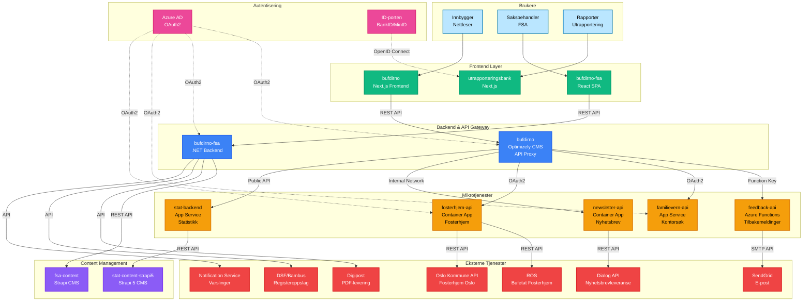

#### 5.1.4 Integrasjonssummering

**Interne integrasjoner (Bufdir-kontrollerte)**:
1. **bufdirno ↔ feedback-api** - Brukertilbakemeldinger med Function Key-autentisering
2. **bufdirno ↔ familievern-api** - Familierådgivningskontorsøk med OAuth2
3. **bufdirno ↔ fosterhjem-api** - Fosterhjemstjenester med OAuth2
4. **bufdirno ↔ newsletter-api** - Nyhetsbrevabonnementer via internt nettverk
5. **bufdirno ↔ stat-backend** - Statistikkdata, offentlig tilgjengelig API
6. **bufdirno-fsa ↔ fsa-content** - Innhold via Strapi REST API
7. **stat-backend ↔ stat-content-strapi5** - Konfigurasjon via Strapi REST API

**Eksterne integrasjoner (Tredjeparter)**:
1. **newsletter-api → Dialog API** - Nyhetsbrevlevering via Make-tjeneste
2. **feedback-api → SendGrid** - E-postvarsler ved negativ tilbakemelding
3. **fosterhjem-api → ROS** - Bufetat fosterhjemsystem (regioner 2-6)
4. **fosterhjem-api → Oslo Kommune API** - Oslo fosterhjemsystem (region 7/8)
5. **bufdirno-fsa → Digipost** - Sikker PDF-levering til innbyggere
6. **bufdirno-fsa → DSF/Bambus** - Nasjonale registeroppslag
7. **bufdirno-fsa → Notification Service** - E-post og SMS-varsler

**Autentiseringsintegrasjoner**:
1. **Azure AD OAuth2** - Brukes av bufdirno, fsa, fosterhjem-api, familievern-api
2. **ID-porten OpenID Connect** - Brukes av utrapporteringsbank for eID-pålogging
3. **Function Keys** - Brukes av feedback-api (Azure Functions)
4. **API Keys** - Brukes for eksterne tjenester (Dialog, ROS, Oslo, SendGrid)

### 5.2 API-integrasjoner

#### 5.2.1 bufdirno → bufdirno-feedback-api
**Purpose**: User feedback collection ("fant du det du lette etter")

**Production Endpoints**:
- `POST https://bufdirnoprodfeedbackapi.azurewebsites.net/api/feedback` - Submit feedback
- `GET https://bufdirnoprodfeedbackapi.azurewebsites.net/api/export` - Export as CSV
- `DELETE https://bufdirnoprodfeedbackapi.azurewebsites.net/api/delete` - Delete feedback

**Authentication**: Azure Function Keys

**Features**:
- reCaptcha v3 validation
- SendGrid email on negative feedback to `nettredaktor@bufdir.no`
- Admin dashboard in CMS for viewing feedback
- CSV export functionality

**Internal Proxy**: `FeedbackApiController.cs` in bufdirno/Site

---

#### 5.2.2 bufdirno → bufdirno-familievern-api
**Purpose**: Family counseling office search by zip code

**Production Endpoints**:
- `GET https://familievern.azurewebsites.net/api/Office/ByZipCode/{zipCode}`
- `GET https://familievern.azurewebsites.net/api/Course`

**Authentication**: OAuth2 with Azure AD
- **Scope**: `api://b9a288ae-6cf4-4b65-ac97-1b3ee9d4542e/.default`

**Data Source**: Excel spreadsheet in Azure Storage

**Usage**: Used by Next.js frontend for office lookup forms

---

#### 5.2.3 bufdirno → bufdirno-fosterhjem-api
**Purpose**: Foster care services (zip lookup, forms, events)

**Production Endpoints**:
- `GET /ZipCode/list` - Foster care office lookup by zip
- `POST /InboundForm` - Form submissions
- `GET /Event/list` - Event listings

**Base URL**: `https://ca-fosterhjem-api-prod.bluemoss-72d501a7.norwayeast.azurecontainerapps.io`

**Authentication**: OAuth2 with Azure AD
- **Scope**: `api://0c4c1255-4646-46bb-a5ca-35f06fdf14fe/.default`

**Deployment**: Azure Container App

---

#### 5.2.4 bufdirno → bufdirno-newsletter-api
**Purpose**: Newsletter subscription management

**Production Endpoint**:
- `POST https://ca-newsletter-api-prod.internal.bluemoss-72d501a7.norwayeast.azurecontainerapps.io/api/newsletter`

**Authentication**: None (internal network only)

**Deployment**: Azure Container App (internal)

---

#### 5.2.5 bufdirno → stat-backend
**Purpose**: Statistics data for display blocks in CMS

**Production Endpoint**:
- `GET https://statistikk.bufdir.no/api/*`

**Integration**: Statistics blocks in Optimizely fetch data from this API

**Dependencies**: stat-backend pulls content configuration from stat-content-strapi5

---

#### 5.2.6 bufdirno Next.js → bufdirno Optimizely CMS API
**Purpose**: Internal API for page data and content delivery

**Internal Endpoints** (in `FamilyServicesController.cs`):
- `GET /api/familyservices/office/{pageId}` - Office details and associated events
- `GET /api/familyservices/event/{pageId}` - Event registration data
- `GET /api/familyservices/event/filters` - Event filtering options (regions, types)

**Authentication**: Bearer token (`bearerauth`)

**Pattern**: Next.js frontend server-side renders pages by fetching structured data from Optimizely backend

---

#### 5.2.7 bufdirno-fsa → bufdirno-fsa-content (Strapi)
**Purpose**: Headless CMS providing localized content

**Integration Type**: REST API (Strapi Content API)

**Data**:
- Localized text strings
- Form configurations
- Content blocks

---

#### 5.2.8 bufdirno-fsa → External Services
**Integrations**:
- **Digipost**: PDF generation and secure digital postal delivery
- **DSF Integration** (Bambus): National registry lookups
- **Notification Service**: Email and SMS notifications

---

#### 5.2.9 stat-backend → stat-content-strapi5
**Purpose**: Content and configuration for statistics displays

**Integration Type**: REST API (Strapi Content API)

**Data**:
- Statistics block configurations
- Data source mappings
- Display settings

---

### 5.3 Autentisering & Sikkerhet

**OAuth2 with Azure AD**:
- Most APIs use scoped access tokens
- Managed Identity for Azure-hosted services
- Service Principal authentication for inter-service communication

**Azure KeyVault**:
- Centralized secret management
- Connection strings, API keys, certificates
- Environment-specific configurations

**API Keys & Function Keys**:
- Azure Functions use function-level keys
- Feedback API uses separate keys per endpoint (submit, export, delete)

**reCaptcha v3**:
- Protects feedback submission endpoint
- Score-based validation (threshold configurable)

---

### 5.4 Konfigurasjonseksempel

From `appsettings.production.json`:

```json
{
  "InternalResources": {
    "Resources": {
      "FamilievernKontor": {
        "Url": "https://familievern.azurewebsites.net/api/Office/ByZipCode/",
        "Scopes": "api://b9a288ae-6cf4-4b65-ac97-1b3ee9d4542e/.default"
      },
      "Feedback": {
        "Url": "https://bufdirnoprodfeedbackapi.azurewebsites.net/api/feedback",
        "FunctionKey": "#{feedback-functionKey}#"
      },
      "FostercareZip": {
        "Url": "https://ca-fosterhjem-api-prod.bluemoss-72d501a7.norwayeast.azurecontainerapps.io/ZipCode/list",
        "Scopes": "api://0c4c1255-4646-46bb-a5ca-35f06fdf14fe/.default"
      },
      "Newsletter": {
        "Url": "https://ca-newsletter-api-prod.internal.bluemoss-72d501a7.norwayeast.azurecontainerapps.io/api/newsletter",
        "Scopes": "none"
      }
    }
  },
  "Statistics": {
    "ApiUrl": "https://statistikk.bufdir.no/api"
  }
}
```

---

## 6. Monitorering og Varsling

For å sikre driftsstabilitet og rask feildeteksjon i Bufdir.no-løsningen anbefales det å implementere en helhetlig monitorerings- og varslingsstrategi.

### 6.1 Anbefalt løsning: Hybrid Monitorering
Bufdir.no benytter en **hybrid monitoreringsmodell** for å sikre optimal observabilitet:

1.  **Frontend (Nettleser): Azure Application Insights SDK**
    *   Brukes for **Real User Monitoring (RUM)**.
    *   Fanger opp sidevisninger, brukersesjoner, klientside-Exceptions og ytelse (Core Web Vitals).
    *   Fordel: Spesialtilpasset for nettlesere, enkel integrasjon uten behov for OpenTelemetry Collector proxy.
2.  **Backend (.NET & Node.js Server): OpenTelemetry**
    *   Brukes for server-side instrumentering.
    *   Fanger opp HTTP-forespørsler, databasekall (SQL/NoSQL) og utgående avhengigheter.
    *   Fordel: Industristandard, høy ytelse, leverandørnøytral og Microsofts primære anbefaling for moderne backender.
3.  **Korrelasjon:** Begge verdener kobles sammen ved bruk av **W3C Trace Context**. Dette sikrer at en forespørsel kan følges fra brukerens nettleser, gjennom alle mikrotjenester og helt ned til databasen.

### 6.2 Implementering

#### 6.2.1 Arkitektur

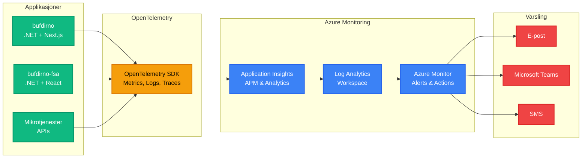

#### 6.2.2 Implementeringssteg

**1. Sett opp Application Insights**
Opprett en felles Application Insights-ressurs i Azure for hele prosjektet.

**2. Installer SDK-er**

```bash
# Frontend (React/Next.js Browser)
npm install @microsoft/applicationinsights-web

# Backend (Node.js Server)
npm install @azure/monitor-opentelemetry @opentelemetry/api

# Backend (.NET)
# Legg til NuGet-pakke: Azure.Monitor.OpenTelemetry.AspNetCore
```

**3. Konfigurer Backend (.NET)**

```csharp
services.AddOpenTelemetry()
    .ConfigureResource(r => r.AddService("MinTjeneste"))
    .UseAzureMonitor(o => o.ConnectionString = "...");
```

**4. Konfigurer Backend (Node.js)**

```javascript
const { useAzureMonitor } = require("@azure/monitor-opentelemetry");
useAzureMonitor({ connectionString: "..." });
```

**5. Konfigurer Frontend (Browser)**

```javascript
import { ApplicationInsights } from '@microsoft/applicationinsights-web';
const appInsights = new ApplicationInsights({ config: {
  connectionString: '...',
  distributedTracingMode: 2 // W3C
}});
appInsights.loadAppInsights();
```

**5. Konfigurer varsler i Azure Monitor**

Opprett varsler for:
- **Tilgjengelighet**: Response time > 3s, Availability < 99%
- **Feil**: HTTP 5xx errors > 10/min, Exception rate > 5/min
- **Ytelse**: CPU > 80%, Memory > 85%, Request queue length > 100
- **Secrets**: Secrets som utløper innen 30 dager

#### 6.2.3 Anbefalt metrikk og alarmer

| Kategori | Metrikk | Terskelverdi | Alvorlighet |
|----------|---------|--------------|-------------|
| **Tilgjengelighet** | HTTP Availability | < 99% | Kritisk |
| **Responstid** | Server Response Time | > 3 sekunder | Høy |
| **Feil** | HTTP 5xx-feil | > 10/minutt | Kritisk |
| **Exceptions** | Exception Rate | > 5/minutt | Høy |
| **Ytelse** | CPU Utilization | > 80% | Middels |
| **Ytelse** | Memory Usage | > 85% | Middels |
| **Database** | SQL Connection Pool | > 80% utnyttelse | Høy |
| **Secrets** | Sertifikater/Secrets | < 30 dager til utløp | Høy |
| **Eksterne API** | Dependency Call Failures | > 5% failure rate | Høy |

#### 6.2.4 Dashboards

Opprett dashboards for:
- **System Health Overview**: Samlet oversikt over alle tjenester
- **Per-Service Metrics**: Detaljert oversikt per mikrotjeneste
- **Dependencies Map**: Visuell oversikt over tjenesteavhengigheter
- **User Experience**: Frontend-ytelse og brukeropplevelse
- **Secrets Expiration**: Oversikt over Secrets som snart utløper

#### 6.2.5 Fordeler med denne løsningen

- **Helhetlig observability**: Metrics, logs og traces på ett sted
- **Azure-integrasjon**: Automatisk integrasjon med Azure-tjenester
- **Distribuert tracing**: Spor requests på tvers av alle mikrotjenester
- **Anomalideteksjon**: AI-basert deteksjon av uvanlige mønstre
- **Fleksibilitet**: Vendor-nøytral standard med OpenTelemetry
- **Kostnadseffektivt**: Bygget inn i Azure-økosystemet

---

## 7. Driftsrutiner

Dette kapitlet beskriver anbefalte driftsrutiner for å sikre stabil drift, sikkerhet og dataintegritet i Bufdir.no-løsningen.

### 7.1 Backup og Gjenoppretting

#### 7.1.1 Databaser

**Azure SQL Database (bufdirno, FSA)**

- **Automatisk backup**: Azure SQL Database har automatisk point-in-time restore
- **Oppbevaringstid**: 7-35 dager (konfigurbar)
- **Long-term retention (LTR)**: Ukentlig, månedlig og årlig backup i opptil 10 år
- **Geo-redundans**: Aktivér geo-redundant backup for disaster recovery

```bash
# Konfigurer long-term retention policy
az sql db ltr-policy set \
  --resource-group rg-bufdir-prod \
  --server bufdir-sql-server \
  --database bufdir-db \
  --weekly-retention P4W \
  --monthly-retention P12M \
  --yearly-retention P5Y \
  --week-of-year 1
```

**PostgreSQL (FSA Strapi, Utrapporteringsbank)**

- **Automatisk backup**: Daglig backup med 7-35 dagers oppbevaring
- **Geo-redundans**: Konfigurer geo-redundant backup storage
- **Testing**: Test restore-prosedyre kvartalsvis

```bash
# Restore PostgreSQL database til et tidspunkt
az postgres flexible-server restore \
  --resource-group rg-bufdir-prod \
  --name bufdir-fsa-strapi-restored \
  --source-server bufdir-fsa-strapi \
  --restore-time "2024-01-15T13:00:00Z"
```

**MySQL (stat-content-strapi5)**

- **Automatisk backup**: Daglig backup med konfigurerbar oppbevaring
- **Manuell backup**: Ta manuell backup før større endringer

**Cosmos DB (stat-backend)**

- **Continuous backup**: Aktivér continuous backup mode (30 dagers point-in-time restore)
- **Periodic backup**: Alternativt bruk periodic backup mode med geo-redundans

```bash
# Aktivér continuous backup for Cosmos DB
az cosmosdb update \
  --resource-group rg-bufdir-prod \
  --name bufdir-cosmos-db \
  --backup-policy-type Continuous
```

#### 7.1.2 Blob Storage og Media Files

**Azure Blob Storage**

- **Soft delete**: Aktivér soft delete (30 dagers oppbevaring)
- **Versioning**: Aktivér blob versioning for automatisk versjonskontroll
- **Immutable storage**: Vurder WORM (Write Once Read Many) for compliance

```bash
# Aktivér soft delete for blobs
az storage blob service-properties delete-policy update \
  --account-name stbufdirweb \
  --enable true \
  --days-retained 30

# Aktivér blob versioning
az storage account blob-service-properties update \
  --account-name stbufdirweb \
  --enable-versioning true
```

#### 7.1.3 Backup-rutiner og Sjekkliste

**Daglig**
- ✅ Verifiser at automatiske backups kjører (sjekk Azure Portal)
- ✅ Overvåk backup-alerts i Azure Monitor

**Ukentlig**
- ✅ Gjennomgå backup-logs for feil eller advarsler
- ✅ Verifiser at long-term retention policies fungerer

**Månedlig**
- ✅ Test restore-prosedyre for én database (roterende)
- ✅ Dokumenter restore-test i driftslogg

**Kvartalsvis**
- ✅ Full disaster recovery-test (restore til test-miljø)
- ✅ Oppdater disaster recovery-plan
- ✅ Gjennomgå og juster backup retention policies

#### 7.1.4 Gjenopprettingsprosedyre

**RTO (Recovery Time Objective)**: 4 timer
**RPO (Recovery Point Objective)**: 1 time

**Steg for gjenoppretting:**

1. **Identifiser omfang**: Avklar hvilke systemer som må gjenopprettes
2. **Varsle stakeholders**: Informer driftsteam og ledelse
3. **Restore database**:
   ```bash
   # Point-in-time restore
   az sql db restore \
     --dest-name bufdir-db-restored \
     --resource-group rg-bufdir-prod \
     --server bufdir-sql-server \
     --source-database bufdir-db \
     --time "2024-01-15T13:00:00Z"
   ```
4. **Oppdater connection strings**: Pek applikasjoner til restored database
5. **Verifiser data-integritet**: Kjør smoke tests
6. **Overvåk systemet**: Følg med i 24 timer etter restore

---

### 7.2 Secrets-rotering

#### 7.2.1 Azure AD Client Secrets

**Rotasjonsfrekvens**: Hver 12. måned (før 24-måneders utløp)

**Prosedyre:**

1. **Opprett ny Client Secret** (3 måneder før utløp):
   ```bash
   az ad app credential reset \
     --id <app-id> \
     --append \
     --display-name "Client Secret 2024-Q2" \
     --years 2
   ```

2. **Oppdater KeyVault**:
   ```bash
   az keyvault secret set \
     --vault-name bufdir-keyvault \
     --name "AzureAd--ClientSecret" \
     --value "<new-secret-value>"
   ```

3. **Test i test-miljø**: Verifiser at ny secret fungerer

4. **Deploy til produksjon**: Restart applikasjoner for å laste ny secret

5. **Overvåk i 1 uke**: Sjekk for feil i Application Insights

6. **Fjern gammel secret**: Slett gammel secret fra Azure AD etter 1 uke

#### 7.2.2 ID-porten Client Secrets

**Rotasjonsfrekvens**: Årlig eller ved kompromittering

**Prosedyre:**

1. Generer ny Client Secret i ID-porten admin portal
2. Oppdater KeyVault med ny secret
3. Test integrasjonen i test-miljø
4. Deploy til produksjon
5. Slett gammel secret fra ID-porten

#### 7.2.3 API-nøkler (SendGrid, Dialog, ROS, Oslo)

**Rotasjonsfrekvens**: Hver 6. måned

**Prosedyre per tjeneste:**

1. **SendGrid**:
   - Opprett ny API key i SendGrid dashboard
   - Oppdater KeyVault: `SendGrid--ApiKey`
   - Test e-postutsendelse
   - Revoke gammel API key

2. **Dialog/Make API**:
   - Opprett ny API key i Dialog admin
   - Oppdater KeyVault: `Dialog--ApiKey`
   - Test nyhetsbrevabonnement
   - Deaktiver gammel key

3. **ROS & Oslo Kommune API**:
   - Kontakt API-leverandør for ny nøkkel
   - Oppdater KeyVault
   - Test integrasjon med fosterhjem-api
   - Revoke gammel nøkkel

#### 7.2.4 Strapi Admin Secrets

**Rotasjonsfrekvens**: Hver 6. måned

**Prosedyre:**

1. Generer nye secrets:
   ```bash
   # APP_KEYS (4 keys)
   openssl rand -base64 32

   # API_TOKEN_SALT
   openssl rand -base64 16

   # ADMIN_JWT_SECRET
   openssl rand -base64 32

   # TRANSFER_TOKEN_SALT
   openssl rand -base64 16

   # JWT_SECRET
   openssl rand -base64 32
   ```

2. Oppdater environment variables eller KeyVault

3. Restart Strapi containers

4. Re-generate API tokens hvis nødvendig

#### 7.2.5 Rotasjonskalender

| Secret Type | Frekvens | Ansvarlig | Neste rotasjon |
|-------------|----------|-----------|----------------|
| Azure AD Client Secrets | 12 måneder | DevOps | Q2 2024 |
| ID-porten Client Secret | 12 måneder | DevOps | Q3 2024 |
| SendGrid API Key | 6 måneder | DevOps | Q2 2024 |
| Dialog API Key | 6 måneder | DevOps | Q1 2024 |
| ROS API Key | 6 måneder | DevOps | Q2 2024 |
| Oslo API Key | 6 måneder | DevOps | Q2 2024 |
| Strapi Secrets (FSA) | 6 måneder | DevOps | Q1 2024 |
| Strapi Secrets (Stat) | 6 måneder | DevOps | Q1 2024 |

#### 7.2.6 Varsling ved Secrets-utløp

**Azure KeyVault Event Grid Integration:**

Konfigurer automatiske varsler når secrets nærmer seg utløp:

```bash
# Opprett Event Grid subscription for KeyVault events
az eventgrid event-subscription create \
  --name keyvault-secret-expiry \
  --source-resource-id /subscriptions/.../resourceGroups/rg-bufdir-prod/providers/Microsoft.KeyVault/vaults/bufdir-keyvault \
  --endpoint-type webhook \
  --endpoint https://bufdir-alerts.azurewebsites.net/api/SecretExpiryHandler \
  --included-event-types Microsoft.KeyVault.SecretNearExpiry \
  --advanced-filter data.DaysToExpiry NumberLessThanOrEquals 30
```

**Azure Monitor Alert Rules:**

Opprett flere alert rules for ulike varslingsterskler:

```bash
# Alert 90 dager før utløp (tidlig varsel)
az monitor metrics alert create \
  --name "Secrets-Expiring-90-Days" \
  --resource-group rg-bufdir-prod \
  --scopes /subscriptions/.../resourceGroups/rg-bufdir-prod/providers/Microsoft.KeyVault/vaults/bufdir-keyvault \
  --condition "count DaysToExpiry < 90" \
  --window-size 1d \
  --evaluation-frequency 1d \
  --severity 2 \
  --description "Secrets expire in less than 90 days - prepare for rotation"

# Alert 30 dager før utløp (kritisk varsel)
az monitor metrics alert create \
  --name "Secrets-Expiring-30-Days" \
  --resource-group rg-bufdir-prod \
  --scopes /subscriptions/.../resourceGroups/rg-bufdir-prod/providers/Microsoft.KeyVault/vaults/bufdir-keyvault \
  --condition "count DaysToExpiry < 30" \
  --window-size 1d \
  --evaluation-frequency 1d \
  --severity 1 \
  --description "URGENT: Secrets expire in less than 30 days"

# Alert 7 dager før utløp (kritisk varsel)
az monitor metrics alert create \
  --name "Secrets-Expiring-7-Days" \
  --resource-group rg-bufdir-prod \
  --scopes /subscriptions/.../resourceGroups/rg-bufdir-prod/providers/Microsoft.KeyVault/vaults/bufdir-keyvault \
  --condition "count DaysToExpiry < 7" \
  --window-size 1d \
  --evaluation-frequency 12h \
  --severity 0 \
  --description "CRITICAL: Secrets expire in less than 7 days - immediate action required"
```

**Action Groups for varsling:**

```bash
# Opprett Action Group med multiple notification channels
az monitor action-group create \
  --name "Secrets-Rotation-Team" \
  --resource-group rg-bufdir-prod \
  --short-name "SecRotate" \
  --email-receiver \
    name="DevOps-Lead" \
    email-address="devops@bufdir.no" \
    use-common-alert-schema=true \
  --email-receiver \
    name="Security-Team" \
    email-address="security@bufdir.no" \
    use-common-alert-schema=true \
  --sms-receiver \
    name="OnCall-DevOps" \
    country-code="47" \
    phone-number="12345678" \
  --webhook-receiver \
    name="Teams-Channel" \
    service-uri="https://outlook.office.com/webhook/..." \
    use-common-alert-schema=true
```

**Azure Logic App for automatisk varsling:**

Opprett en Logic App som sjekker secrets daglig og sender detaljerte rapporter:

```json
{
  "definition": {
    "$schema": "https://schema.management.azure.com/providers/Microsoft.Logic/schemas/2016-06-01/workflowdefinition.json#",
    "triggers": {
      "Recurrence": {
        "type": "Recurrence",
        "recurrence": {
          "frequency": "Day",
          "interval": 1,
          "schedule": {
            "hours": ["8"],
            "minutes": [0]
          }
        }
      }
    },
    "actions": {
      "List_Secrets": {
        "type": "ApiConnection",
        "inputs": {
          "host": {
            "connection": {
              "name": "@parameters('$connections')['keyvault']['connectionId']"
            }
          },
          "method": "get",
          "path": "/secrets"
        }
      },
      "Filter_Expiring_Secrets": {
        "type": "Query",
        "inputs": {
          "from": "@body('List_Secrets')",
          "where": "@less(item()['attributes']['expires'], addDays(utcNow(), 90))"
        }
      },
      "Send_Email": {
        "type": "ApiConnection",
        "inputs": {
          "host": {
            "connection": {
              "name": "@parameters('$connections')['office365']['connectionId']"
            }
          },
          "method": "post",
          "path": "/v2/Mail",
          "body": {
            "To": "devops@bufdir.no",
            "Subject": "Secrets Expiration Report - @{utcNow()}",
            "Body": "<h2>Secrets som snart utløper:</h2><ul>@{body('Filter_Expiring_Secrets')}</ul>"
          }
        }
      }
    }
  }
}
```

**Azure Function for avansert varsling:**

Implementer en Azure Function som kjører daglig og sender strukturerte varsler:

```csharp
[FunctionName("SecretExpiryChecker")]
public static async Task Run(
    [TimerTrigger("0 0 8 * * *")] TimerInfo timer, // Kjører kl 08:00 hver dag
    ILogger log)
{
    var client = new SecretClient(
        new Uri(Environment.GetEnvironmentVariable("KeyVaultUri")),
        new DefaultAzureCredential());

    var expiringSecrets = new List<SecretExpiryInfo>();

    await foreach (var secret in client.GetPropertiesOfSecretsAsync())
    {
        if (secret.ExpiresOn.HasValue)
        {
            var daysToExpiry = (secret.ExpiresOn.Value - DateTimeOffset.UtcNow).Days;

            if (daysToExpiry <= 90)
            {
                expiringSecrets.Add(new SecretExpiryInfo
                {
                    Name = secret.Name,
                    ExpiresOn = secret.ExpiresOn.Value,
                    DaysToExpiry = daysToExpiry,
                    Severity = GetSeverity(daysToExpiry)
                });
            }
        }
    }

    if (expiringSecrets.Any())
    {
        await SendExpiryNotifications(expiringSecrets, log);
    }
}

private static string GetSeverity(int daysToExpiry)
{
    return daysToExpiry switch
    {
        <= 7 => "🔴 KRITISK",
        <= 30 => "🟠 HØYT",
        <= 90 => "🟡 MODERAT",
        _ => "🟢 LAV"
    };
}

private static async Task SendExpiryNotifications(
    List<SecretExpiryInfo> secrets,
    ILogger log)
{
    // Send til Microsoft Teams
    var teamsMessage = new
    {
        title = "⚠️ Secrets Expiration Alert",
        text = $"**{secrets.Count} secrets** utløper snart:",
        sections = secrets.Select(s => new
        {
            activityTitle = s.Name,
            activitySubtitle = $"Utløper: {s.ExpiresOn:yyyy-MM-dd}",
            facts = new[]
            {
                new { name = "Dager igjen", value = s.DaysToExpiry.ToString() },
                new { name = "Alvorlighet", value = s.Severity }
            }
        })
    };

    var teamsWebhook = Environment.GetEnvironmentVariable("TeamsWebhookUrl");
    await PostToTeams(teamsWebhook, teamsMessage);

    // Send e-post til DevOps-teamet
    await SendEmailNotification(secrets);

    log.LogInformation($"Sent expiry notifications for {secrets.Count} secrets");
}
```

**Varslingseskalering:**

| Dager til utløp | Alvorlighet | Varslingskanal | Frekvens |
|-----------------|-------------|----------------|----------|
| 90 dager | 🟡 Moderat | E-post til DevOps | Ukentlig |
| 30 dager | 🟠 Høyt | E-post + Teams | Daglig |
| 14 dager | 🟠 Høyt | E-post + Teams + SMS | Daglig |
| 7 dager | 🔴 Kritisk | E-post + Teams + SMS + Telefon | 2x daglig |
| 3 dager | 🔴 Kritisk | Alle kanaler + Incident | Kontinuerlig |

**Dashboard for Secrets-overvåking:**

Opprett et Azure Dashboard som viser:
- Liste over alle secrets med utløpsdato
- Visuell tidslinje for secrets-utløp
- Status for secret rotation (planlagt, pågår, fullført)
- Historikk over roterte secrets

```bash
# Eksempel query i Log Analytics for dashboard
SecretExpiryEvents
| where TimeGenerated > ago(90d)
| where DaysToExpiry <= 90
| summarize count() by SecretName, DaysToExpiry, bin(TimeGenerated, 1d)
| order by DaysToExpiry asc
| render timechart
```

---

### 7.3 Sertifikathåndtering

#### 7.3.1 SSL/TLS Sertifikater

**Automatisk fornyelse med Azure App Service Managed Certificates:**

- Bufdir.no bruker Azure-managed certificates som fornyes automatisk
- Ingen manuell inngripen nødvendig
- Overvåk sertifikatstatus i Azure Portal

**Custom certificates (hvis brukt):**

**Rotasjonsfrekvens**: 90 dager før utløp

**Prosedyre:**

1. Bestill nytt sertifikat fra sertifikatutsteder
2. Last opp til Azure KeyVault:
   ```bash
   az keyvault certificate import \
     --vault-name bufdir-keyvault \
     --name bufdir-ssl-cert \
     --file certificate.pfx \
     --password <pfx-password>
   ```
3. Oppdater App Service/Container App binding
4. Test HTTPS-tilkobling
5. Fjern gammelt sertifikat etter 7 dager

#### 7.3.2 Overvåking

```bash
# List alle sertifikater og utløpsdatoer
az keyvault certificate list \
  --vault-name bufdir-keyvault \
  --query "[].{name:name, expires:attributes.expires}" \
  --output table
```

---

### 7.4 Logging og Oppbevaring

#### 7.4.1 Log-kategorier

**Application Logs**
- **Oppbevaring**: 90 dager i Application Insights
- **Arkivering**: Eksporter til Azure Storage for langtidsoppbevaring (7 år for compliance)

**Audit Logs (Azure AD, KeyVault)**
- **Oppbevaring**: 90 dager i Azure Monitor
- **Arkivering**: Eksporter til immutable storage (10 år)

**Security Logs**
- **Oppbevaring**: 365 dager
- **Arkivering**: Permanent arkivering for sikkerhetsincidenter

#### 7.4.2 Log-eksport til Storage

```bash
# Konfigurer diagnostikk-eksport til storage account
az monitor diagnostic-settings create \
  --name bufdir-logs-archive \
  --resource /subscriptions/.../resourceGroups/rg-bufdir-prod/providers/Microsoft.Web/sites/bufdir-app \
  --storage-account stbufdirlogarchive \
  --logs '[{"category": "AppServiceHTTPLogs", "enabled": true, "retentionPolicy": {"enabled": true, "days": 2555}}]'
```

#### 7.4.3 Oppbevaringspolicy

| Log-type | Aktiv (Hot) | Arkiv (Cool/Archive) | Total |
|----------|-------------|----------------------|-------|
| Application Logs | 90 dager | 7 år | 7 år |
| Audit Logs | 90 dager | 10 år | 10 år |
| Security Logs | 365 dager | Permanent | ∞ |
| Performance Metrics | 30 dager | 2 år | 2 år |
| Access Logs | 90 dager | 1 år | 1 år |

#### 7.4.4 GDPR og Personvern

- **Persondata**: Slett eller anonymiser etter 5 år (eller ved forespørsel)
- **Audit trail**: Behold i 10 år for compliance
- **Anonymisering**: Implementer rutiner for å anonymisere gamle logger

---

### 7.5 Sikkerhetsoppdateringer

#### 7.5.1 Container Images

**Frekvens**: Månedlig eller ved kritiske sårbarheter

**Prosedyre:**

1. **Scan images for sårbarheter**:
   ```bash
   # Bruk Azure Container Registry vulnerability scanning
   az acr task create \
     --name vulnerability-scan \
     --registry bufdirregistry \
     --context /dev/null \
     --schedule "0 2 * * 0"  # Hver søndag kl 02:00
   ```

2. **Oppdater base images**:
   - Oppdater Dockerfile med nyeste base image tags
   - Rebuild og test i dev/test-miljø

3. **Deploy til produksjon**:
   - Bruk Azure Pipelines for automatisk deployment
   - Overvåk for errors i 24 timer

#### 7.5.2 NuGet/npm Packages

**Frekvens**: Månedlig (minor/patch), ved kritiske sårbarheter (major)

**Prosedyre:**

1. **Scan dependencies**:
   ```bash
   # .NET
   dotnet list package --vulnerable --include-transitive

   # Node.js
   npm audit
   ```

2. **Oppdater packages**:
   ```bash
   # .NET
   dotnet add package <PackageName> --version <Version>

   # Node.js
   npm update
   ```

3. **Test thoroughly**: Kjør alle tester før deployment

4. **Deploy med gradvis rollout**: Start med test → QA → prod

#### 7.5.3 Azure Services

**Frekvens**: Kontinuerlig (Azure håndterer automatisk)

**Overvåking:**
- Følg med på Azure Service Health
- Abonner på Azure updates: https://azure.microsoft.com/updates/
- Gjennomgå Azure Advisor recommendations ukentlig

#### 7.5.4 Patch Management Kalender

| Komponent | Frekvens | Ansvarlig | Neste oppdatering |
|-----------|----------|-----------|-------------------|
| Container Base Images | Månedlig | DevOps | 1. mars 2024 |
| .NET Packages | Månedlig | Utviklere | 15. feb 2024 |
| npm Packages | Månedlig | Utviklere | 15. feb 2024 |
| Azure Services | Automatisk | Azure | - |
| Operating Systems | Automatisk | Azure | - |

#### 7.5.5 Incident Response

**Ved kritisk sårbarhet:**

1. **Vurder alvorlighet**: CVSS score > 7.0 = kritisk
2. **Emergency patch**: Deploy hotfix innen 24 timer
3. **Kommuniser**: Varsle stakeholders og brukere hvis nødvendig
4. **Post-mortem**: Dokumenter incident og forbedringer

**Kontaktpersoner:**
- **Security Lead**: [navn@bufdir.no]
- **DevOps Lead**: [navn@bufdir.no]
- **Azure Support**: Opprett support ticket i Azure Portal

---

## 8. Komme i Gang

1. **Start with bufdirno** - The main portal is the central application
2. **Set up Azure access** - Most projects require Azure authentication
3. **Install prerequisites**:
   - .NET SDK (version per project)
   - Node.js (version per project)
   - Azure CLI: `az login --tenant fantomet.onmicrosoft.com`
4. **Configure secrets** - Copy `.env.example` files and populate with secrets
5. **Follow project-specific READMEs** for detailed setup instructions
