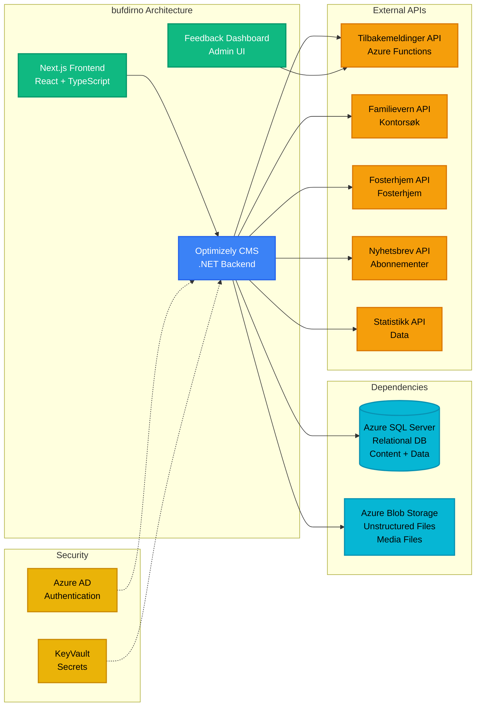

# Bufdir.no Webportal - bufdirno

**Stack**: Optimizely CMS + Next.js
**Repository**: `bufdirno/`
**Solution File**: `BufdirWeb.sln`

Hovednettsiden for Bufdir.no, bygget på Optimizely CMS for innholdsadministrasjon med en Next.js frontend for moderne webopplevelser.

**Funksjonalitet**: Fungerer som primærportalen for Bufdir (Barne-, ungdoms- og familiedirektoratet), og tilbyr omfattende informasjon om barnevern, familietjenester, adopsjon, fosterhjem og sosialtjenester i Norge. Nettstedet gjør det mulig for innholdsredaktører å administrere rikt medieinnhold gjennom Optimizely CMS, samtidig som det leverer raske, SEO-optimaliserte sider til innbyggere via Next.js. Viktige funksjoner inkluderer dynamiske innholdsblokker, integrasjon med ulike mikrotjenester for tilbakemeldingsinnsamling, nyhetsbrevabonnement, statistikkvisualisering og kontor-/tjenestesøk. Plattformen støtter flerspråklig innholdsleveranse og integreres med Azure AD for sikker administrativ tilgang.

**Nøkkelkomponenter**:
- **Backend**: .NET-applikasjon med Optimizely CMS
- **Frontend**: Next.js React-applikasjon (`src/NextJs/`)
- **Database**: Azure SQL Server (relasjonsdatabase for CMS-innhold, sidedata og applikasjonsdata)
- **Blob Storage**: Azure Blob Storage (mediafiler, bilder, dokumenter)
- **Infrastructure**: Azure (KeyVault, Container Apps)
- **Authentication**: Azure AD (OAuth2 for CMS-administratortilgang og API-autentisering)

**Runtime Environment**: Azure Container App (.NET + Node.js)
- **Deployment**: Azure Pipelines (backend.yml, frontend.yml)
- **Environments**:
  - **Development/Test**: Container App `bufdirnext` (rg-ny.bufdir.no)
  - **Sandbox**: Container App `bufdirnext-sandbox` (rg-ny.bufdir.no)
  - **QA**: Container App `bufdirnext-qa` (rg-ny.bufdir.no)
  - **Production**: Container App `bufdirnext-prod` (rg-bufdirweb-prod)
- **CI/CD**: Automatisert utrulling ved branch-sammenslåing
- **Container Registry**: `crbufdirnodevtest.azurecr.io`
- **Resource Group**: rg-ny.bufdir.no (test/qa), rg-bufdirweb-prod (production)

**Development**:
- Backend: Visual Studio eller `dotnet run`
- Frontend: `npm run dev` (kjører på https://localhost:3000)
- CMS Admin: https://localhost:44320/EPiServer/Cms

**Konfigurasjon / Miljøvariabler**:

| Variabel | Beskrivelse | Kilde |
|----------|-------------|-------|
| `ConnectionStrings:EPiServerDB` | Azure SQL Server tilkoblingsstreng for CMS | KeyVault |
| `ConnectionStrings:EpiserverBlobs` | Azure Blob Storage tilkoblingsstreng | KeyVault |
| `AzureAd:TenantId` | Azure AD tenant ID | Config |
| `AzureAd:ClientId` | Azure AD applikasjons-ID | Config |
| `InternalResources:ClientSecret` | Hemmelighet for API-integrasjoner | KeyVault |
| `InternalResources:CaptchaSecretKey` | Google reCAPTCHA nøkkel | KeyVault |
| `ApplicationInsights:ConnectionString` | Application Insights for logging | KeyVault |
| `ElasticSearch:CloudId` | Elasticsearch cloud ID for søk | KeyVault |
| `ElasticSearch:ApiKey` | Elasticsearch API-nøkkel | KeyVault |
| `Statistics:ApiUrl` | URL til statistikk-API | Config |
| `FeedbackApi:Mail:SendGridKey` | SendGrid API-nøkkel for e-post | KeyVault |
| `AzureStorageQueue:ConnectionString` | Queue storage for Optimizely-hendelser | KeyVault |
| `Serilog:WriteTo:SeqSink:Args:apiKey` | Seq logging API-nøkkel | KeyVault |

**API Integrasjoner** (InternalResources:Resources):

| API | Beskrivelse | Autentisering |
|-----|-------------|---------------|
| `FamilievernKontor` | Familierådgivningskontorer API | OAuth2 scope |
| `Feedback` | Tilbakemeldinger API | Function key |
| `FostercareZip/Form/Events` | Fosterhjem API | OAuth2 scope |
| `Newsletter` | Nyhetsbrev API | Internal network |
