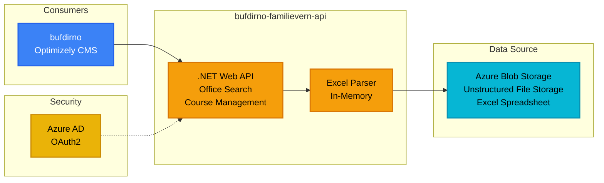

# Familievern API - bufdirno-familievern-api

**Stack**: .NET API
**Repository**: `bufdirno-familievern-api/`

API for søk etter familierådgivningskontorer.

**Funksjonalitet**: Tilbyr en lettvekts søke- og informasjonstjeneste for å finne familierådgivningskontorer (familierådgivningskontorer) over hele Norge. API-et parser kontordata fra Excel-regneark lagret i Azure Blob Storage, og opprettholder en in-memory cache for raske oppslag. Innbyggere kan søke etter postnummer, kommune eller region for å finne nærmeste familierådgivningskontor, inkludert kontaktinformasjon, adresser og åpningstider. API-et administrerer også informasjon om rådgivningskurs og programmer som tilbys på forskjellige steder. Denne mikrotjenesten konsumeres av hovedportalen bufdirno for å vise interaktive kontorlokalisatorer og tjenestekatalog, slik at innbyggere raskt kan få tilgang til lokale familierådgivningstjenester.



**Data Source**: Azure Blob Storage - Excel spreadsheet (stbufdirweb > bufdirfamilievernexceltest)
- Type: Unstructured file storage
- Format: Excel (.xlsx) containing office locations, contact information, and metadata
- Access: In-memory parsing for fast lookups

**Authentication**: Azure AD OAuth2
- Scope: `api://b9a288ae-6cf4-4b65-ac97-1b3ee9d4542e/.default`
- Service Principal authentication
- Consumed by bufdirno with delegated permissions

**Key Features**:
- In-memory parsing of Excel spreadsheet
- Office search functionality
- Swagger UI for API documentation

**Dependencies**:
- Azurite (Azure Storage Emulator)

**Konfigurasjon / Miljøvariabler**:
- `AzureKeyVaultEnabled` - Aktiverer Azure KeyVault (true/false)
- `AzureKeyVaultName` - KeyVault navn (kv-familievernapi)
- `RequireAuthentication` - Krever autentisering (true/false)
- `Excel:ConnectionString` - Azure Blob Storage tilkoblingsstreng
- `Excel:ContainerName` - Blob container navn (bufdirfamilievernexceltest)
- `Excel:FileName` - Excel filnavn (masterdata.xlsx)
- `AzureAd:Instance` - Azure AD instance URL
- `AzureAd:TenantId` - Azure AD tenant ID
- `AzureAd:ClientId` - Azure AD applikasjons-ID
- `Mail:SendgridKey` - SendGrid API-nøkkel for e-postvarslinger
- `Mail:SenderEmail` - Avsender e-postadresse
- `Recipients:ValidPostfixes` - Gyldige e-postdomener (bufdir.no, bufetat.no)

**Runtime Environment**: Azure App Service (.NET)
- **Deployment**: Azure Pipelines (azure-pipelines.yml)
- **Environments**:
  - **Development**: App Service `familievernApi`
  - **QA**: App Service `familievern-qa`
  - **Production**: App Service `familievern`
- **CI/CD**: Automated deployment on branch merges
- **Hosting**: Azure App Service
- **Production URL**: https://familievern.azurewebsites.net

**Development**:
```bash
npm install -g azurite
azurite  # Run in terminal
```
