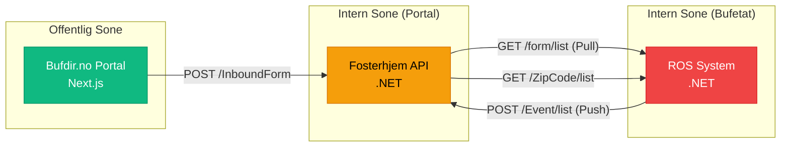
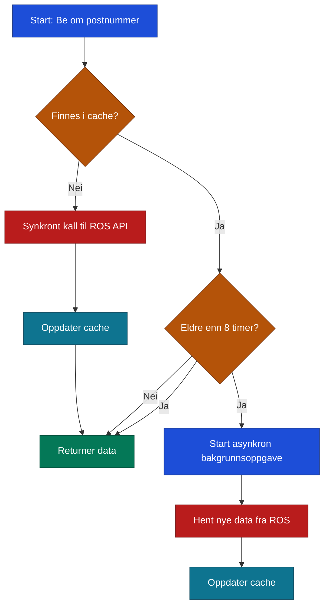
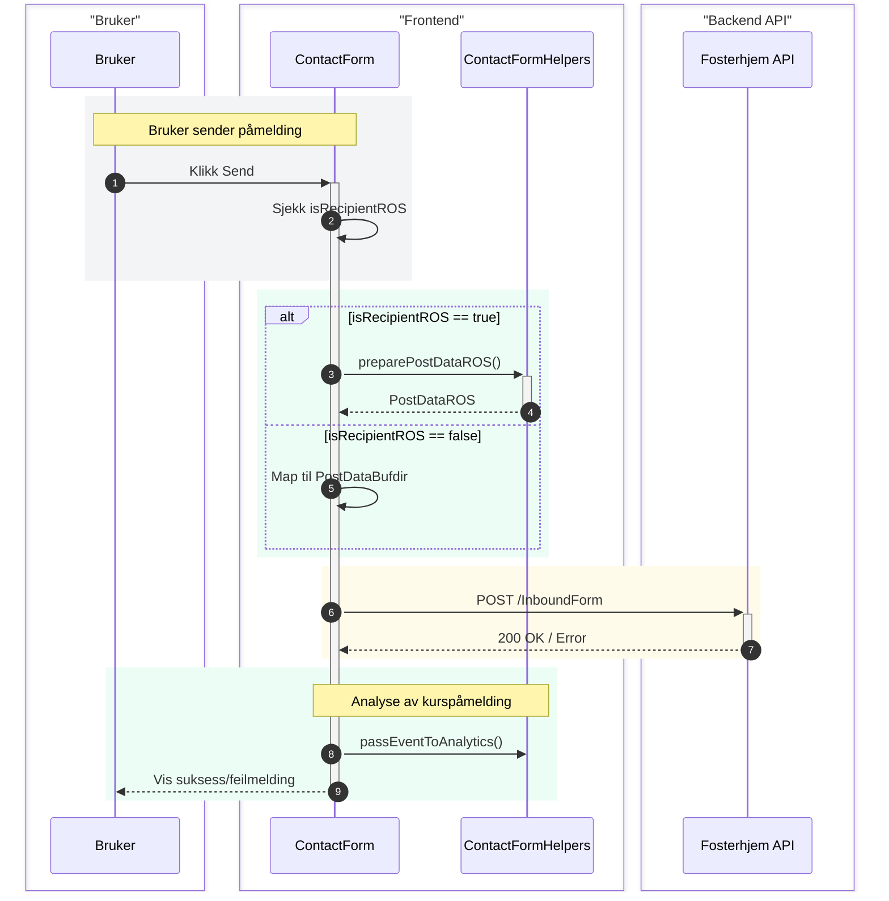
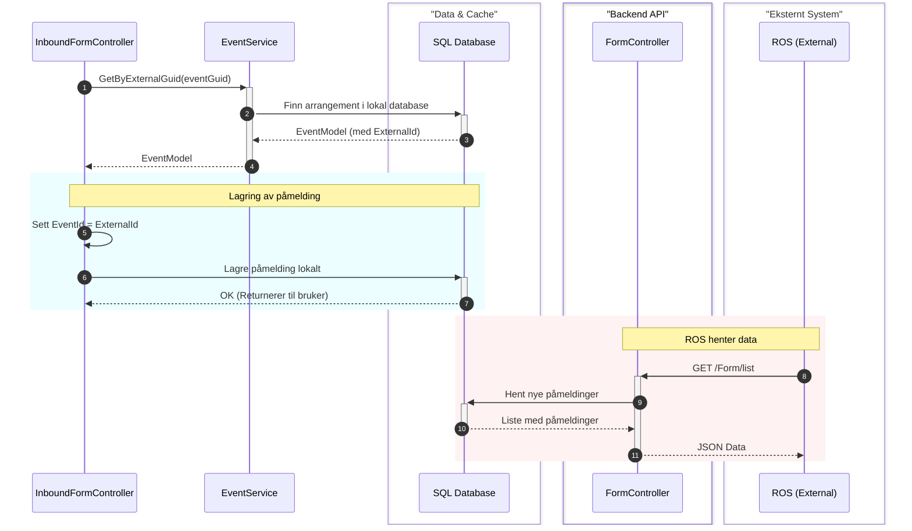
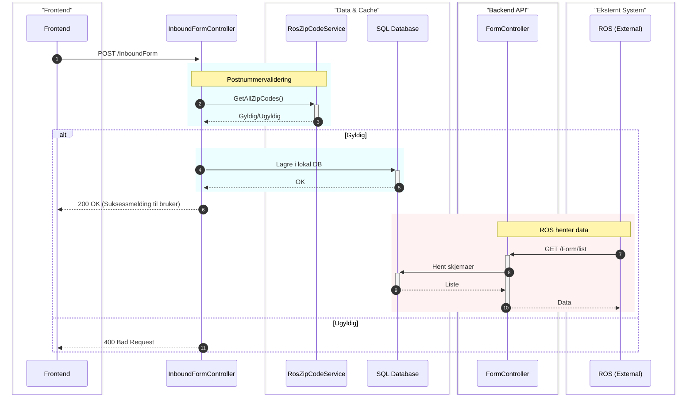

# Integrasjon med ROS (Rekruttering og Oppfølging av Statlige fosterhjem)

## Innholdsfortegnelse
1. [1. Oversikt](#1-oversikt)
    - [1.1 Arkitektur: Overordnet Flyt](#11-arkitektur-overordnet-flyt)
    - [1.2 Nettverkssoner og Sikkerhet](#12-nettverkssoner-og-sikkerhet)
2. [2. Integrasjonsbeskrivelser](#2-integrasjonsbeskrivelser)
    - [2.1 Postnummervalidering](#21-postnummervalidering)
    - [2.2 Arrangementssynkronisering](#22-arrangementssynkronisering)
    - [2.3 Henvendelseshåndtering](#23-henvendelseshåndtering)
3. [3. Prosesser i ROS-systemet](#3-prosesser-i-ros-systemet)
4. [4. Infrastruktur og Felles Konfigurasjon](#4-infrastruktur-og-felles-konfigurasjon)

Dette dokumentet beskriver hvordan løsningen er integrert med **ROS**, som er Bufetats system for håndtering av fosterhjemsdata og saksbehandling.

## 1. Oversikt
Integrasjonen fungerer som et bindeledd mellom den offentlige webportalen (Bufdir.no) og Bufetats interne systemer. Hovedmålet er å validere brukerdata og sørge for at henvendelser fra publikum havner i riktig region i ROS-systemet.

### Funksjonalitet
Integrasjonen er delt inn i tre hovedområder:
1.  **Postnummervalidering**: Portal-API-et henter og cacher det offisielle registeret fra ROS for å validere postnummer og mappe dem til riktig kontor.
2.  **Arrangementssynkronisering**: ROS pusher automatisk nye/endrede kurs og møter til portalen. Portal-API-et kobler påmeldinger til disse via `eventGuid`.
3.  **Henvendelseshåndtering**: Portal-API-et lagrer henvendelser lokalt, mens ROS henter (puller) disse asynkront og overfører dem til sitt interne saksbehandlingssystem.

### 1.1 Arkitektur: Overordnet Flyt
Dette diagrammet viser hvordan data flyter mellom den offentlige portalen, integrasjons-API-et og ROS-systemet.

### 1.2 Nettverkssoner og Sikkerhet
For å ivareta sikkerhet og kontrollert dataflyt er løsningen delt inn i tre logiske soner med ulikt tillitsnivå:

1.  **Offentlig Sone**:
    *   **Innhold**: Inkluderer Next.js-frontend som kjører i Azure. Dette er den eneste delen av løsningen som er direkte eksponert mot internett.
    *   **Sikkerhet**: Det er ingen direkte tilgang fra denne sonen til interne fagsystemer eller databaser. All datautveksling må gå via Fosterhjem API.

2.  **Intern Sone (Portal)**:
    *   **Innhold**: Her kjører `bufdirno-fosterhjem-api` (.NET) og tilhørende SQL-database.
    *   **Sikkerhet**: Sonen befinner seg i et sikkert nettverkssegment (VNet) i Azure. API-et fungerer som en sikkerhetsbuffer og proxy som validerer og vasker alle data før de eventuelt gjøres tilgjengelig for ROS. Dette hindrer direkte angrep mot fagsystemet fra internett.

3.  **Intern Sone (Bufetat)**:
    *   **Innhold**: Bufetats eget interne bedriftsnettverk der ROS-systemet og saksbehandlingsverktøyene befinner seg.
    *   **Sikkerhet**: Dette miljøet er fysisk og logisk separert fra portal-infrastrukturen. Kommunikasjon skjer kun over krypterte linjer og krever autorisering via API-nøkler (`X-Api-Key`) som er lagret sikkert i Azure KeyVault.

---

## 2. Integrasjonsbeskrivelser

### 2.1 Postnummervalidering
Denne integrasjonen sørger for at systemet kun aksepterer henvendelser for geografiske områder som dekkes av ROS, og mapper postnummer til riktig kontor og region.

### Tekniske Komponenter
*   **`RosZipCodeService`** (`Infrastructure/Services/RosZipCodeService.cs`): 
    *   Henter gyldige postnummer fra ROS API via endepunktet `api/ZipCode/list` (linje 81).
    *   Implementerer caching-logikk for å sikre ytelse (linje 61-133).
*   **`ZipCodeController`** (`ROS.Web/Api/ZipCodeController.cs` i ROS):
    *   Eksponerer det offisielle postnummerregisteret via `List()`-metoden.
*   **`InboundFormController`** (`Api/Controllers/InboundFormController.cs`): 
    *   Validerer brukerens postnummer mot ROS-data i `Post`-metoden (linje 68-75).
*   **`Postal Search Modal`** (`PostalSearchModal.tsx`):
    *   Global komponent som aktiveres når brukere søker etter kontorer på forsiden. Bruker integrasjonen for å verifisere gyldighet før innsending.

### Algoritme: Caching-strategi
For å sikre lav responstid brukes en "smart" cache-strategi i `RosZipCodeService`:

1.  **Be om postnummer**: En forespørsel om geografisk data mottas av tjenesten.
2.  **Cache-oppslag**: Systemet sjekker om data finnes i den distribuerte cachen.
3.  **Håndtering ved tom cache**: Hvis cachen er tom, utføres et synkront API-kall til ROS. Cachen populeres umiddelbart før data returneres til brukeren.
4.  **Sjekk av alder**: Hvis data finnes, sjekkes tidsstempelet.
5.  **Umiddelbar retur**: Hvis dataene er ferske (under 8 timer), returneres de umiddelbart.
6.  **Bakgrunnsoppdatering**: Hvis dataene er eldre enn 8 timer, returneres de eksisterende dataene umiddelbart for å unngå ventetid, men det startes samtidig en asynkron bakgrunnsoppgave (`Task.Run`) for å hente ferske data fra ROS API og oppdatere cachen for fremtidige forespørsler.

### Datakontrakt: `ZipCodeDto`
Representerer geografisk informasjon fra ROS.

| Felt | Type | Beskrivelse |
| :--- | :--- | :--- |
| `ZipCode` | `string`| Postnummeret. |
| `Name` | `string`| Navn på poststed. |
| `AreaId` | `int` | ID for området i ROS. |
| `AreaName` | `string` | Navn på området/kontoret. |
| `RegionId` | `int` | ID for regionen i ROS. |
| `RegionName` | `string` | Navn på regionen. |

---

### 2.2 Arrangementssynkronisering
Denne integrasjonen håndterer flyten når brukere melder seg på kurs eller informasjonsmøter som administreres i ROS.

### Tekniske Komponenter
*   **`InboundFormController`**: 
    *   Håndterer kobling mellom web-påmelding og ROS-arrangement via `EventGuid` (linje 82-103).
    *   Lagrer påmeldingen i den lokale databasen for senere avhenting av ROS.
*   **`FosterhjemApiService`** (`ROS.Application/Services/FosterhjemApiService.cs` i ROS):
    *   `EventSync()`: Pusher nye/endrede arrangementer fra ROS til portal-API-et.
    *   `FormSync()`: Puller nye påmeldinger fra portal-API-et.
*   **`FormController`** (`Api/Controllers/FormController.cs`):
    *   Tilbyr endepunktet `GET /Form/list` som ROS bruker for å hente (pull) nye påmeldinger.
*   **`Foster Care Event Page`** (`FosterCareEventPage.tsx`):
    *   Sidetemplate for kursdetaljer (URL: `/fosterhjem/kontorer/[kontor]/meetings/[event]`).
    *   Bruker `RequestType.EventBooking` (type 5).
*   **`ContactFormHelpers.ts`**:
    *   Mapper hendelsen til Matomo-analyse for kurspåmelding via `passEventToAnalytics` (linje 8).

### Datakontrakt: `EventDto`
Representerer et arrangement hentet fra ROS.

| Felt | Type | Beskrivelse |
| :--- | :--- | :--- |
| `ExternalId` | `int?` | Intern numerisk ID i ROS. |
| `ExternalGuid` | `Guid` | Global unik ID brukt for mapping mot web. |
| `Title` | `string` | Tittel på arrangementet. |
| `Type` | `string` | Kategorisering (f.eks. "Kurs"). |
| `FromDate` | `DateTime` | Starttidspunkt. |
| `ToDate` | `DateTime` | Sluttidspunkt. |
| `Location` | `string` | Oppmøtested eller digital lenke. |
| `Areas` | `List<AreaDto>` | Liste over kontorer knyttet til arrangementet. |

#### Underkontrakt: `AreaDto`
Brukt i `EventDto` for å spesifisere deltakende kontorer.

| Felt | Type | Beskrivelse |
| :--- | :--- | :--- |
| `ExternalId` | `int` | ID for kontoret i ROS. |
| `Name` | `string` | Navn på kontoret. |
| `Organizer` | `bool` | Markerer om kontoret er hovedarrangør. |

### Algoritme: Arrangementssynkronisering (Frontend)
Denne algoritmen i Next.js avgjør datakontrakt og ruting før API-kall, samt sporing av konverteringer for kurs og møter:

1.  **Innsending**: Brukeren fyller ut skjemaet og klikker på send-knappen.
2.  **Valg av kontrakt**: `ContactForm` sjekker `isRecipientROS`-flagget.
3.  **Datapreparering**: Hvis mottakeren er ROS, kalles `preparePostDataROS` for å formatere dataene korrekt (inkludert mapping av `eventGuid`).
4.  **API-kall**: Dataene sendes til backend via `POST /InboundForm`.
5.  **Analyse**: Etter at svaret er mottatt fra API-et, kalles `passEventToAnalytics`.
6.  **Konverteringssporing**: Hvis det er en kurspåmelding (`requestType` 5), sendes en spesifikk hendelse til Matomo med detaljer om arrangementet.
7.  **Tilbakemelding**: Brukeren får se en bekreftelse på at påmeldingen er sendt.

### Algoritme: Arrangementssynkronisering (Backend)
Når en påmelding mottas i `InboundFormController`, mappes `EventGuid` til ROS sin interne ID, og påmeldingen lagres i databasen. ROS henter deretter ut påmeldingene asynkront:

1.  **Motta påmelding**: API-et mottar påmeldingsdata med en `EventGuid`.
2.  **Oppslag av arrangement**: `EventService` gjør et oppslag i den lokale databasen for å finne arrangementet.
3.  **Hente ROS-ID**: Systemet henter `ExternalId` (ROS sin interne ID) som er knyttet til arrangementets `Guid`.
4.  **Persistering**: Påmeldingen lagres i den lokale databasen med status `Pending`.
5.  **Kvittering**: Brukeren får en umiddelbar bekreftelse (`200 OK`).
6.  **Polling**: ROS-systemet poller periodisk `GET /Form/list` endepunktet.
7.  **Datautveksling**: `FormController` returnerer alle nye påmeldinger, og markerer dem som `InTransit`.

---

### 2.3 Henvendelseshåndtering
Dette er den mest omfattende integrasjonen som automatiserer innsending av kontaktforespørsler direkte til Bufetats saksbehandlere.

### Tekniske Komponenter
*   **`InboundFormController`**: Mottar skjemadata, validerer postnummer og lagrer henvendelsen lokalt.
*   **`FormController`**: Tilbyr endepunkt for at ROS kan hente nye henvendelser.
*   **`FosterhjemApiService`** (i ROS): Håndterer periodisk avhenting (`FormSync`) og oppdatering av status.
*   **`FormRequestService`** (`ROS.Application/Services/FormRequestService.cs` i ROS): Lagrer henvendelsen i ROS-databasen via `SaveForm()`.
*   **`ContactForm.tsx`**: Håndterer logikken for å skille mellom ROS og andre mottakere (linje 227).
*   **`ContactFormHelpers.ts`**: Formaterer data til ROS-spesifikt format i `preparePostDataROS` (linje 45).
*   **Sider**: Brukes på `Foster Care Office Page` og `Local Office Contact Page`.

### Algoritme: Henvendelseshåndtering (Backend)
Hovedflyten i API-et ved mottak av henvendelse og hvordan ROS henter disse asynkront:

1.  **Motta henvendelse**: `InboundFormController` mottar skjemaet fra frontend.
2.  **Validere postnummer**: Postnummeret sjekkes mot listen over gyldige ROS-postnummer fra `RosZipCodeService`.
3.  **Avvisning ved feil**: Hvis postnummeret ikke finnes i ROS-systemet, returneres `400 Bad Request`.
4.  **Lagring**: Ved gyldig postnummer lagres henvendelsen i den lokale SQL-databasen.
5.  **Bekreftelse**: En suksessmelding returneres til brukeren.
6.  **Avhenting**: ROS poller `GET /Form/list` for å hente nye henvendelser og overføre dem til sitt eget saksbehandlingssystem.

### 3. Prosesser i ROS-systemet

Dette kapittelet beskriver hvordan integrasjonen håndteres på ROS-siden av løsningen (kildekode i `Ros/ros-next`).

### 3.1 FosterhjemApiService
Denne tjenesten (`ROS.Application/Services/FosterhjemApiService.cs`) er motoren i integrasjonen på ROS-siden og kjører asynkrone bakgrunnsjobber for synkronisering.

*   **EventSync**: Identifiserer nye eller endrede arrangementer i ROS-databasen og sender dem samlet til portal-API-et via `POST /Event/list`. Dette sikrer at portalen alltid har oppdatert informasjon om kurs og møter.
*   **FormSync**: Poller portal-API-et (`GET /form/list`) for nye henvendelser og påmeldinger. Etter behandling sender den en kvittering tilbake (`PATCH /form`) med status for hver enkelt form (f.eks. `Sucess`, `Rejected`, `Failed`).

### 3.2 Håndtering av Henvendelser (SaveForm)
Når ROS mottar en henvendelse via `FormSync`, behandles den av `FormRequestService.cs` før den lagres permanent i ROS-databasen:

1.  **Duplikatkontroll**: Sjekker om `FormGuid` allerede eksisterer i tabellen `FormRequests` for å unngå dobbeltlagring.
2.  **Geografisk Mapping**: Bruker internt postnummerregister for å finne tilhørende `AreaId` (kontor) og `RegionId` basert på postnummeret i henvendelsen.
3.  **Opprettelse av FormRequest**: Dataene fra portalen mappes til ROS sin interne domenemodell `FormRequest`.
4.  **Tilgjengeliggjøring**: Henvendelsen blir umiddelbart synlig for saksbehandlere i ROS-grensesnittet under det aktuelle kontorets oversikt.

### 3.3 Geografiske Data og API-er
ROS fungerer som "master" for geografisk ruting og Bufetats organisasjonsstruktur:

*   **ZipCodeController**: Eksponerer `api/ZipCode/list`. Dette er kilden `RosZipCodeService` i portal-API-et bruker for å validere postnummer.
*   **AreaController**: Eksponerer `api/Area/list`. Brukes for å hente oversikt over områder/kontorer og hvilken region de tilhører.

---

### 4. Infrastruktur og Felles Konfigurasjon
Dette er de underliggende komponentene som støtter alle integrasjonsområdene.

### Sentrale Datakontrakter (DTO-er)

#### Datakontrakt: `InboundFormDto`
Denne kontrakten definerer dataene som sendes fra frontend til backend-API-et.

| Felt | Type | Beskrivelse |
| :--- | :--- | :--- |
| `EventGuid` | `Guid?` | Unik ID for arrangementet (påkrevd ved arrangementspåmelding). |
| `PostNumber` | `string` | Brukerens postnummer for ruting til riktig region/kontor. |
| `Name` | `string` | Fullt navn på innsender. |
| `Phone` | `string` | Telefonnummer. |
| `Email` | `string` | E-postadresse. |
| `Type` | `FormType` | Type henvendelse (f.eks. `EventBooking` eller `ContactMe`). |

#### Datakontrakt: `PostDataROS`
Formatert objekt som brukes i Next.js før innsending til API-et.

| Felt | Type | Beskrivelse |
| :--- | :--- | :--- |
| `eventGuid` | `string` | Valgfri kobling til et spesifikt arrangement. |
| `type` | `number` | ROS-spesifikk numerisk forespørselstype (f.eks. 4 eller 5). |
| `name` | `string` | Navn på innsender. |
| `email` | `string` | E-postadresse. |
| `phone` | `string` | Telefonnummer. |
| `zipCode` | `string` | Postnummer brukt for geografisk ruting. |

### Tilkobling og Sikkerhet
*   **Oppsett av tilkobling**: 
    *   **`StartupExtensions.cs`**: Konfigurerer `HttpClient` med `BaseAddress` og `X-Api-Key` (linje 26-32).
    *   **`HttpClients.cs`**: Definerer navnet `RosHttpClient`.
*   **Geografi-data**: `RosService` henter felles lister over områder og regioner fra `api/Area/list` (linje 42).
*   **Sikkerhet**: Tilgangen styres via API-nøkler administrert i Azure KeyVault og base-URL konfigurasjon (`RosApiBaseUrl`).
*   **Arkitektur**: I det overordnede [arkitekturdiagrammet](architecture.md) er ROS definert som en **External Service** som `FosterhjemAPI` kommuniserer med.
