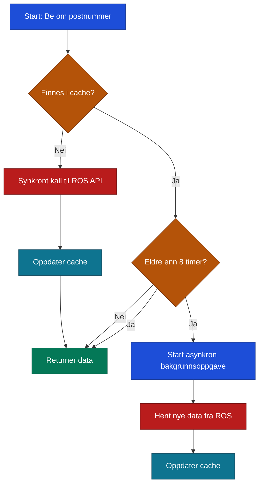
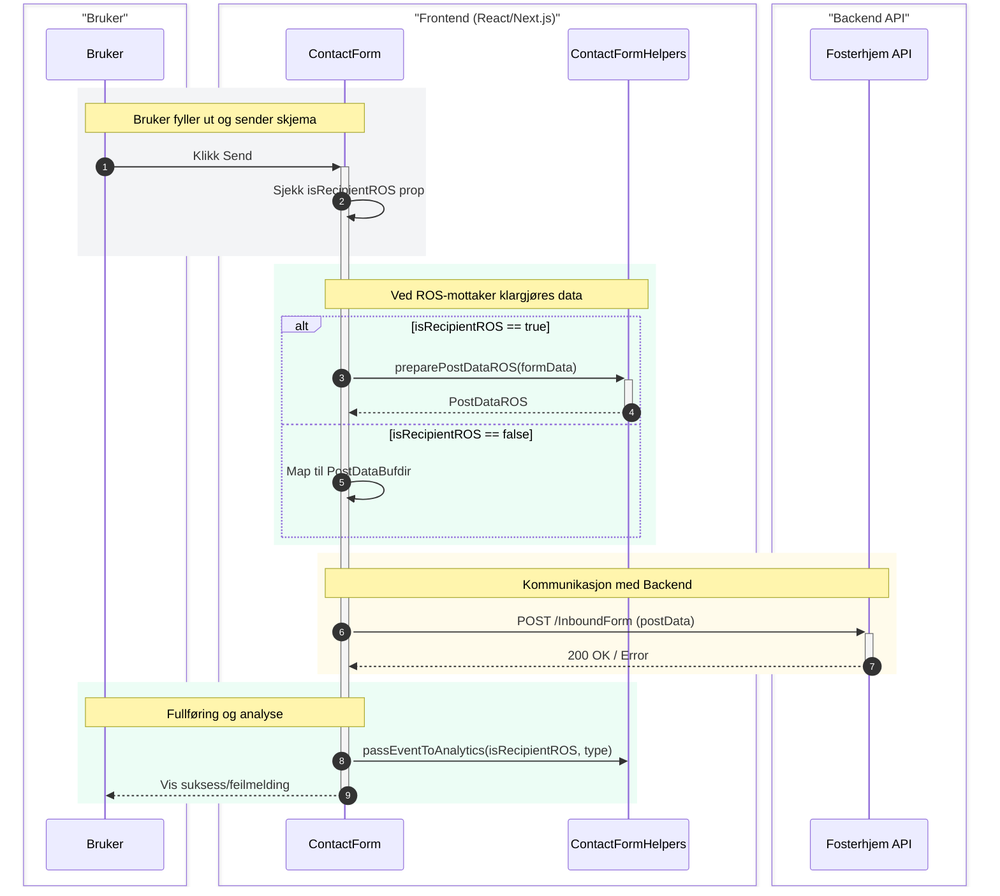
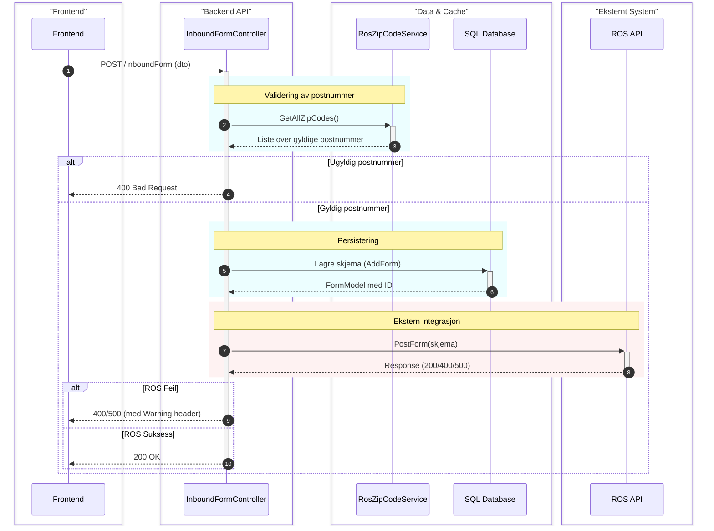

# Integrasjon med ROS (Rekruttering og Oppfølging av Statlige fosterhjem)

Dette dokumentet beskriver hvordan løsningen er integrert med **ROS**, som er Bufetats system for håndtering av fosterhjemsdata og saksbehandling.

## Oversikt
Integrasjonen fungerer som et bindeledd mellom den offentlige webportalen (Bufdir.no) og Bufetats interne systemer. Hovedmålet er å validere brukerdata (som postnummer) og sørge for at henvendelser fra publikum havner i riktig region i ROS-systemet.

## Arkitektur og Komponenter

### 1. Backend-integrasjon (`bufdirno-fosterhjem-api`)
Dette er hovedpunktet for integrasjonen. Microservicen fungerer som en proxy og valideringslag mot ROS.

*   **`RosZipCodeService`** (`Infrastructure/Services/RosZipCodeService.cs`): 
    *   Henter gyldige postnummer fra ROS API via endepunktet `api/ZipCode/list` (linje 81).
    *   Implementerer caching-logikk for å redusere antall kall mot ROS (linje 61-133).
*   **`RosService`** (`Infrastructure/Services/RosService.cs`): 
    *   Håndterer forespørsler for å hente lister over områder og regioner fra `api/Area/list` (linje 42).
*   **`InboundFormController`** (`Api/Controllers/InboundFormController.cs`): 
    *   Mottar skjemadata i `Post`-metoden (linje 61).
    *   Validerer postnummer mot data fra ROS (linje 68-75).
    *   Sender data videre til ROS via `OldFormHandling` (linje 123) dersom mottakeren er ROS.

### 2. Frontend-integrasjon (Next.js / React)
Frontend i `bufdirno` er programmert til å gjenkjenne når en bruker samhandler med funksjonalitet som krever ROS-integrasjon.

*   **`ContactForm.tsx`** (`bufdirno/src/NextJs/src/components/contact_form/ContactForm.tsx`):
    *   Hovedkomponenten for innsending av skjema.
    *   Avgjør om data skal sendes til ROS eller Bufdir (linje 227).
    *   Kaller API-et med formatert data (linje 229).
*   **`ContactFormHelpers.ts`** (`bufdirno/src/NextJs/src/components/contact_form/ContactFormHelpers.ts`):
    *   **`preparePostDataROS`**: Formaterer dataene til `PostDataROS`-formatet som backend forventer for ROS-integrasjon (linje 45).
    *   **`passEventToAnalytics`**: Mapper ROS-spesifikke hendelser (som kurspåmelding eller "kontakt meg") til analyse-verktøy (linje 8).

### 3. Konfigurasjon og Sikkerhet
*   **`StartupExtensions.cs`** (`Api/StartupExtensions.cs`): 
    *   Konfigurerer `HttpClient` for ROS med riktig `BaseAddress` og `X-Api-Key` (linje 26-32).
*   **`HttpClients.cs`** (`Core/Constants/HttpClients.cs`):
    *   Definerer navnet på HTTP-klienten som brukes (`RosHttpClient`).

## Sider og Funksjonalitet som Aktiverer Integrasjonen

ROS-integrasjonen er i bruk på spesifikke områder på Bufdir.no, primært knyttet til fosterhjemstjenester.

### 1. Sider (Page Templates) i Frontend
Følgende sidetemplater i Next.js-applikasjonen bruker ROS-integrasjon via `ContactForm`-komponenten:

*   **Foster Care Event Page** (`FosterCareEventPage.tsx`):
    *   **URL-mønster**: `/fosterhjem/kontorer/[kontor-navn]/meetings/[event-navn]`
    *   **Funksjon**: Påmelding til informasjonsmøter og kurs. Bruker `RequestType.EventBooking` (type 5).
*   **Foster Care Office Page** (`FosterCareOfficePage.tsx`):
    *   **URL-mønster**: `/fosterhjem/kontorer/[kontor-navn]`
    *   **Funksjon**: Kontaktformular for det spesifikke kontoret ("Kontakt meg"). Bruker `RequestType.ContactMe` (type 4).
*   **Local Office Contact Page** (`LocalOfficeContact.tsx`):
    *   **URL-mønster**: `/fosterhjem/kontorer/[region-navn]/kontakt`
    *   **Funksjon**: Generell kontaktforespørsel til et regionkontor.

### 2. Globale Komponenter
*   **Postal Search Modal** (`PostalSearchModal.tsx`):
    *   Denne komponenten dukker opp som en modal når en bruker søker etter fosterhjemskontor via postnummer på forsiden eller andre landingssider for fosterhjem.
    *   Den inneholder et kontaktskjema som er koblet direkte mot ROS-integrasjonen.

### 3. Aktiverings-URL-er (API-endepunkter)
Integrasjonen aktiveres ved kall til følgende endepunkter i `bufdirno-fosterhjem-api`:

*   **Skjemainnsending**: `POST /InboundForm` (kalles via `/api/fostercare/form` proxy i frontend).
*   **Postnummervalidering**: `GET /ZipCode/list` (brukes internt i backend og for oppslag).
*   **Områdeinfo**: `GET /api/Area/list` (brukes for å hente geografi-data).

## Datakontrakter (DTO-er)

Her er de sentrale datastrukturene som brukes i integrasjonen:

### 1. InboundFormDto
Dette er kontrakten for innsending av skjema fra frontend til backend (`bufdirno-fosterhjem-api`).

| Felt | Type | Beskrivelse |
| :--- | :--- | :--- |
| `EventGuid` | `Guid?` | Unik ID for arrangement (valgfri). |
| `PostNumber`| `string`| Postnummeret til brukeren. |
| `Name` | `string`| Navnet på innsender. |
| `Phone` | `string`| Telefonnummer. |
| `Email` | `string`| E-postadresse. |
| `Type` | `FormType?`| Type henvendelse (f.eks. `ContactMe` eller `EventBooking`). |

### 2. ZipCodeDto
Brukes for å representere postnummer og tilhørende geografisk informasjon hentet fra ROS.

| Felt | Type | Beskrivelse |
| :--- | :--- | :--- |
| `ZipCode` | `string`| Postnummeret. |
| `Name` | `string`| Navn på poststed. |
| `AreaId` | `int` | ID for området i ROS. |
| `AreaName` | `string`| Navn på området. |
| `RegionId` | `int` | ID for regionen i ROS. |
| `RegionName`| `string`| Navn på regionen. |

### 3. PostDataROS (Frontend)
Dette er objektet som bygges i Next.js før det sendes til API-et dersom mottakeren er ROS.

| Felt | Type | Beskrivelse |
| :--- | :--- | :--- |
| `eventGuid` | `string?` | Unik ID for arrangement (valgfri). |
| `type` | `number` | ROS-spesifikk forespørselstype (1-6). |
| `name` | `string` | Navn. |
| `email` | `string` | E-postadresse. |
| `phone` | `string` | Telefonnummer. |
| `zipCode` | `string?` | Postnummer. |

## Algoritmer og Prosessflyt

Integrasjonen styres av tre hovedalgoritmer:

### 1. Caching-algoritme for postnummer (`RosZipCodeService`)
For å sikre lav responstid og unngå unødig last på ROS API, brukes en "smart" cache-strategi:

### 2. Dynamisk ruting-algoritme (Frontend)
Når en bruker sender inn et skjema, avgjøres rutingen slik:

### 3. Validering og videresending (`InboundFormController`)
Flyten i backend når et skjema mottas:

1.  **Postnummervalidering**: Slår opp postnummeret mot listen fra `RosZipCodeService`. Ved ugyldig postnummer returneres `400 Bad Request` umiddelbart.
2.  **Lokal lagring**: Skjemaet lagres alltid i lokal database (`_formService.AddForm`) først.
3.  **System-identifisering**: Basert på postnummeret identifiseres hvilket system (ROS eller Oslo) som skal motta dataene via `ClientConfiguration`.
4.  **Videresending**: 
    *   Henvendelsen videresendes til ROS via `RosService.PostForm`.
    *   Dersom ROS returnerer en feil, logges dette, men den lokale lagringen består. Feilmeldinger fra ROS forwardes til frontend med headeren `Warning: Errors-Have-Been-Forwarded`.

## Funksjonalitet

1.  **Postnummervalidering**: Sikrer at brukere taster inn gyldige norske postnummer som tilhører en av Bufetats regioner.
2.  **Arrangementssynkronisering**: Kobler påmeldinger fra web til eksterne arrangementer i ROS via `eventGuid`.
3.  **Henvendelseshåndtering**: Automatiserer flyten av interessenter fra nettsiden direkte inn i saksbehandlingssystemet til Bufetat.

## Eksterne referanser
I arkitekturdiagrammet (`architecture.md`) er ROS definert som en **External Service** som `FosterhjemAPI` kommuniserer med.
