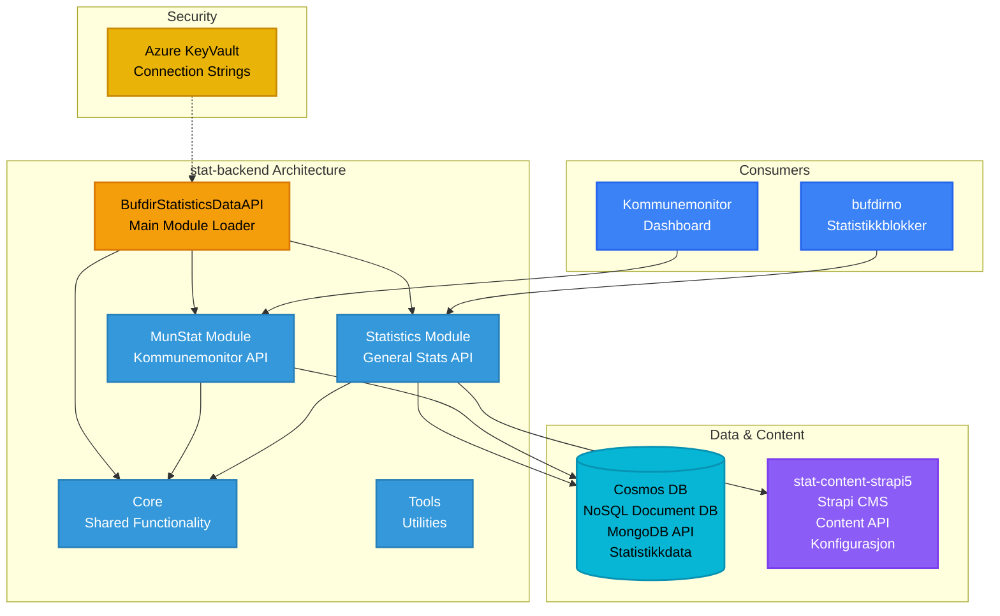

# Statistikk & Data API - stat-backend

**Stack**: .NET 6.0
**Repository**: `stat-backend/`
**Solution File**: `BufdirStatistics.sln`

Modulær statistikk-API som leverer data til diverse Bufdir-tjenester.

**Funksjonalitet**: Leverer statistiske data og analyser gjennom en modulær API-arkitektur som støtter flere spesialiserte tjenester. Systemet består av to hovedmoduler: MunStat (Kommunemonitor) som gir statistikk på kommunenivå og dashboards for lokalmyndigheters overvåking av barnevernsstatistikk, og Statistics-modulen som leverer generell statistisk data for innholdsblokker på Bufdir.no. API-et aggregerer data fra Cosmos DB (MongoDB API) som inneholder tidsseriestatistikk, saksnumre, demografiske opplysninger og trendanalyser. Integrasjon med stat-content-strapi5 gir konfigurerbare datavisualiseringer, diagramdefinisjoner og visningsparametere. Den modulære arkitekturen tillater uavhengig utrulling og skalering av statistikktjenester, med hver modul hostet på separate Azure App Services. Systemet støtter komplekse spørringer, dataaggregering og caching for høy-ytende levering av statistisk innsikt til dashboards og offentlige informasjonssider.

**Konfigurasjon / Miljøvariabler**:

**Azure AD Konfigurasjon**:

| Variabel | Beskrivelse | Kilde |
|----------|-------------|-------|
| `AzureAd:Instance` | Azure AD instance URL | Config |
| `AzureAd:ClientId` | Azure AD applikasjons-ID | Config |
| `AzureAd:TenantId` | Azure AD tenant ID | Config |
| `AzureAd:Domain` | Azure AD domene | Config |

**Generell Konfigurasjon**:

| Variabel | Beskrivelse | Eksempel |
|----------|-------------|----------|
| `ASPNETCORE_ENVIRONMENT` | Miljøtype | LocalDevelopment, Development, Production |
| `APPLICATIONINSIGHTS_CONNECTION_STRING` | Application Insights tilkoblingsstreng | KeyVault |

**MongoDB / Cosmos DB Konfigurasjon** (`MongoDb` section):

| Variabel | Beskrivelse | Kilde |
|----------|-------------|-------|
| `MongoDb:ConnectionString` | Direkte tilkoblingsstreng (prioriteres hvis satt) | KeyVault |
| `MongoDb:Secret` | Navn på KeyVault-hemmelighet for connection string | Config |
| `MongoDb:Host` | MongoDB/Cosmos DB host | Config |
| `MongoDb:Port` | MongoDB/Cosmos DB port | Config |
| `MongoDb:Username` | Database brukernavn | Config |
| `MongoDb:Password` | Database passord | KeyVault |

**Azure Konfigurasjon** (`Azure` section):

| Variabel | Beskrivelse | Kilde |
|----------|-------------|-------|
| `Azure:KeyVaultName` | Azure KeyVault navn for secrets | Config |
| `Azure:TenantId` | Azure tenant ID for KeyVault tilgang | Config |

**Modules**:
- `MunStat` - Municipal monitor API (Kommunemonitor)
- `Statistics` - General statistics API for Strapi blocks
- `Core` - Shared functionality
- `BufdirStatisticsDataAPI` - Main runnable module
- `Tools` - Utility tools

**Database**: Azure Cosmos DB with MongoDB API (NoSQL document database)
- Stores statistical data, time-series data, and aggregated metrics
- MongoDB-compatible API for flexible schema and high-performance queries
- Optimized for read-heavy workloads (statistics dashboards and reports)
- Scalable for large datasets

**Authentication**: Azure KeyVault + IP Whitelisting
- Cosmos DB connection string stored in Azure KeyVault
- Managed Identity for App Service KeyVault access
- Client certificates for inter-service communication

**Runtime Environment**: Azure App Service (.NET)
- **Deployment**: WebDeploy from CI/CD pipeline
- **Environments**: Dev, QA, Production
- **Hosting**: Azure App Service
- **CI/CD**: Azure Pipelines (build and release)

**Development**:
- Local SQL Server or MongoDB for dev
- Visual Studio for .NET 6.0 development
- API access via Swagger for local testing
