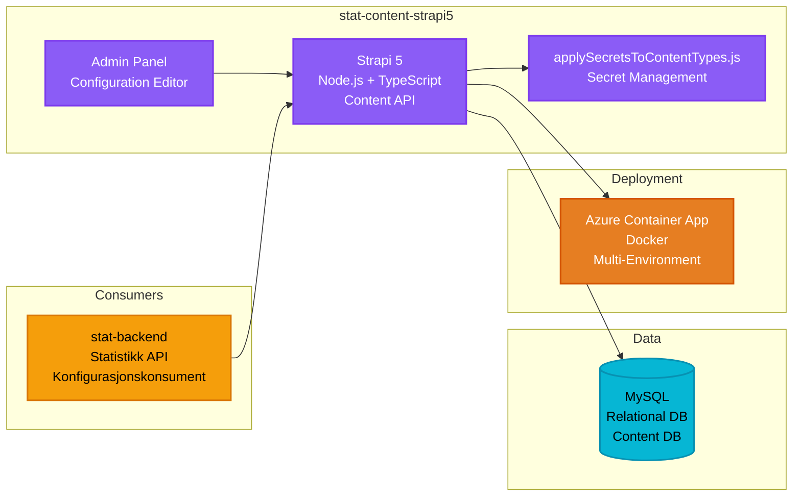

# Statistikk Innholdsadministrasjon - stat-content-strapi5

**Stack**: Strapi 5 (Node.js + TypeScript)
**Repository**: `stat-content-strapi5/`
**Deployment**: Azure Container App

Headless CMS som leverer innhold og konfigurasjon for statistikkvisninger.

**Funksjonalitet**: Administrerer konfigurasjon og metadata for statistiske datavisualiseringer gjennom en Strapi 5 headless CMS. Innholdsredaktører bruker admin-panelet for å definere statistikkblokkonfigurasjoner inkludert diagramtyper (stolpe, linje, kakediagram), datakilde-koblinger, filtreringsparametere, visningstitler, akseetiketter, fargevalg og verktøytipsformater. CMS-en lagrer strukturerte innholdstyper som styrer hvordan statistisk data fra stat-backend presenteres på Bufdir.no og Kommunemonitor-dashboards. Tilpassede skript for hemmelighetsadministrasjon håndterer sikker konfigurasjon av API-endepunkter og legitimasjon. Systemet støtter multi-miljøkonfigurasjoner med separate innstillinger for development, test, QA og production, noe som tillater at statistikkvisninger kan konfigureres og forhåndsvises før publisering. Denne separasjonen av data (stat-backend) fra presentasjonskonfigurasjon (stat-content-strapi5) gjør det mulig for ikke-teknisk personell å oppdatere diagramutseende og dashboard-layouts uten utviklerinngrep.

**Konfigurasjon / Miljøvariabler**:

**Server Konfigurasjon**:

| Variabel | Beskrivelse | Eksempel | Kilde |
|----------|-------------|----------|-------|
| `HOST` | Server host adresse | 0.0.0.0 | Config |
| `PORT` | Server port | 1337 | Config |

**Strapi Secrets**:

| Variabel | Beskrivelse | Kilde |
|----------|-------------|-------|
| `APP_KEYS` | Strapi applikasjonsnøkler (kommaseparert) | KeyVault |
| `API_TOKEN_SALT` | Salt for API tokens | KeyVault |
| `ADMIN_JWT_SECRET` | JWT secret for admin-panel autentisering | KeyVault |
| `TRANSFER_TOKEN_SALT` | Salt for transfer tokens | KeyVault |
| `JWT_SECRET` | JWT secret for generell autentisering | KeyVault |
| `STATISTICS_API_TOKEN` | API token for statistikk-API integrasjon | KeyVault |
| `ENCRYPTION_KEY` | Krypteringsnøkkel for sensitive data | KeyVault |

**Database Konfigurasjon**:

| Variabel | Beskrivelse | Eksempel | Kilde |
|----------|-------------|----------|-------|
| `DATABASE_CLIENT` | Database type | mysql, sqlite, postgres | Config |
| `DATABASE_FILENAME` | Filnavn for SQLite database | String | Config |
| `DATABASE_HOST` | Database server host | hostname | Config |
| `DATABASE_PORT` | Database server port | 3306/5432 | Config |
| `DATABASE_NAME` | Database navn | String | Config |
| `DATABASE_USERNAME` | Database brukernavn | String | KeyVault |
| `DATABASE_PASSWORD` | Database passord | Secret | KeyVault |
| `DATABASE_SSL` | SSL-tilkobling enabled | true/false | Config |
| `DATABASE_SSL_REJECT_UNAUTHORIZED` | Reject unauthorized SSL | true/false | Config |



**Database**: MySQL (relational database)
- Stores Strapi content types, configurations, and metadata
- Contains statistics block definitions, data source mappings, and display settings
- Relational structure for complex content relationships

**Authentication**: None (content API consumed by stat-backend)
- Strapi admin panel protected by Strapi's built-in authentication
- Content API accessed by stat-backend without additional authentication
- Custom secret management via `applySecretsToContentTypes.js`

**Key Features**:
- Multiple environment configurations (.env-dev, .env-test, .env-qa, .env-prod)
- Custom secret management (`applySecretsToContentTypes.js`)
- Docker-based deployment with environment-specific Dockerfiles

**Runtime Environment**: Azure Container App (Node.js + TypeScript)
- **Deployment**: Azure Pipelines (azure-pipeline.yml) + Docker
- **Environments**:
  - Uses variable groups: `stat-content5-test`, `stat-content5-qa`, `stat-content5-prod`
  - Resource names configured per environment in variable groups
- **Reference URL**: https://ca-stat-content-strapi5.greenmushroom-dba12d86.norwayeast.azurecontainerapps.io/api (sandbox)
- **CI/CD**: Docker image build, push to ACR, deploy to Container App with FQDN retrieval
- **Hosting**: Azure Container App
- **Docker Compose**: Available for local development
- **Environment-Specific**: Separate Dockerfiles per environment (dev, test, qa, prod)

**Development**:
```bash
npm install
npm run develop
```
