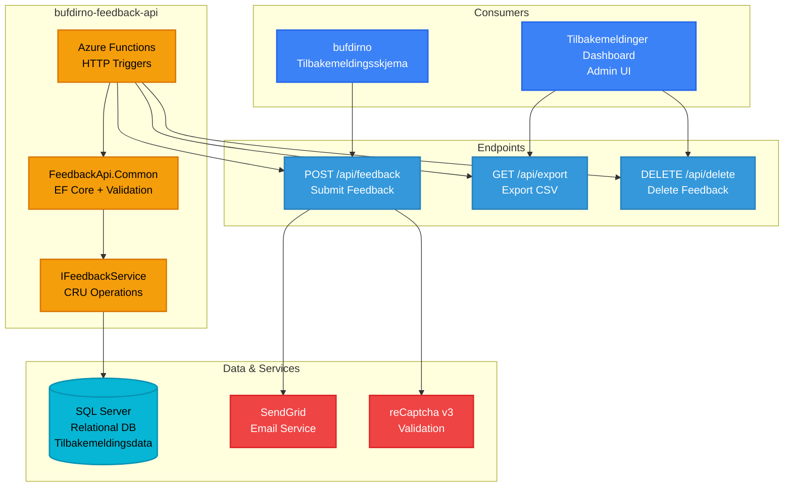

# Tilbakemeldinger API - bufdirno-feedback-api

**Stack**: .NET Azure Functions
**Repository**: `bufdirno-feedback-api/`
**Deployment**: Azure Functions

Mikrotjeneste for mottak av brukertilbakemeldinger fra Bufdir.no ("fant du det du lette etter").

**Funksjonalitet**: Samler inn og administrerer tilbakemeldinger fra brukere gjennom en serverløs arkitektur for å måle innholdets effektivitet og brukertilfredshet på Bufdir.no. Systemet fanger opp "Fant du det du lette etter?"-svar sammen med valgfrie kommentarer fra nettstedbesøkende, og lagrer tilbakemeldinger med metadata som side-URL, tidsstempel og brukervurderinger. Funksjoner inkluderer HTTP-endepunkter for å sende inn tilbakemeldinger, spørre etter tilbakemeldingsstatistikk og generere rapporter. E-postvarsler sendes til innholdsansvarlige via SendGrid når negativ tilbakemelding mottas, noe som muliggjør rask respons på innholdsproblemer. Et administrativt dashbord gir analyser og trenddata for å hjelpe innholdsteam med å identifisere problematiske sider og forbedre informasjonstilgjengelighet. Den serverløse designen sikrer kostnadseffektiv skalering under trafikk-topper samtidig som responstidene holdes under ett sekund.

**Konfigurasjon / Miljøvariabler**:
- `ConnectionStrings:Default` (eller `SQLCONNSTR_Default`, `SQLAZURECONNSTR_Default`) - SQL Server tilkoblingsstreng for feedback-data
- `Mail:SendgridKey` - SendGrid API-nøkkel for e-postvarsler
- `Mail:Recipients` - Liste over e-postmottakere for tilbakemeldingsvarsler
- `Mail:SenderName` - Avsendernavn for e-postvarsler
- `Mail:SenderEmail` - Avsender e-postadresse
- `Mail:Subject` - E-postemnelinje for tilbakemeldingsvarsler



**Projects**:
- `FeedbackApi.Common` - Data access layer (EF Core), validation, and `IFeedbackService`
- `FeedbackApi.Function` - Azure Function with HTTP triggers
- `FeedbackApi.Tests` - Unit tests

**Endpoints**:
- `[POST] api/feedback` - Submit user feedback, sends email on negative feedback
- `[GET] api/export/{pageId:int?}` - Export feedback as CSV

**Key Features**:
- reCaptcha v3 protection
- SendGrid email integration for negative feedback
- EF Core for database access
- CSV export functionality

**Database**: SQL Server (relational database)
- Stores user feedback submissions (positive/negative, comments, page metadata)
- Tables managed via Entity Framework Core migrations
- Supports CSV export for analytics

**Authentication**: Azure Function Keys
- Submit endpoint: Function-level key (public access with reCaptcha protection)
- Export endpoint: Function-level key (admin access)
- Delete endpoint: Function-level key (admin access, protected)
- Admin dashboard: Role-based access (`FeedbackUser`, `FeedbackAdmin` roles)

**Runtime Environment**: Azure Functions (Consumption Plan)
- **Deployment**: Azure Pipelines (azure-pipelines.yml)
- **Environments**:
  - **Development**: Function App `bufdirnoFeedbackApi`
  - **QA**: Function App `bufdirnoQaFeedbackApi`
  - **Production**: Function App `bufdirnoProdFeedbackApi`
- **CI/CD**: Automated deployment via Azure Functions deployment task
- **Hosting**: Azure Functions (serverless, event-driven)
- **Production URL**: https://bufdirnoprodfeedbackapi.azurewebsites.net
- **Trigger Type**: HTTP triggers

**Development**:
```bash
dotnet tool install --global dotnet-ef
dotnet ef database update  # Run in FeedbackApi.Common directory
```
