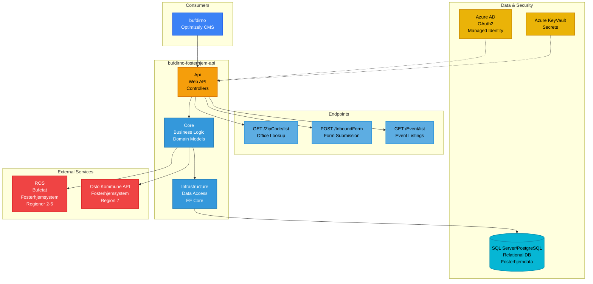

# Fosterhjem API - bufdirno-fosterhjem-api

**Stack**: .NET API
**Repository**: `bufdirno-fosterhjem-api/`
**Solution File**: `BufDirNoApi.sln`

API for fosterhjemstjenester.

**Funksjonalitet**: Administrerer informasjon og arrangementer knyttet til fosterhjemstjenester (fosterhjem) i Norge, og støtter både offentlig informasjonsspredning og skjemainnsending. API-et tilbyr endepunkter for søk etter fosterhjemskontorer etter postnummer, henting av informasjon om fosterhjemsprogrammer og krav, administrering av arrangementsoversikter for opplæring av fosterforeldre og informasjonsmøter, og behandling av innkommende skjemaer fra potensielle fosterforeldre. Tjenesten følger Clean Architecture-prinsipper med separate lag for API-kontrollere, kjerneforretningslogikk og datatilgang via Entity Framework Core. Integrasjon med Azure AD OAuth2 sikrer sikker tilgang når den kalles fra bufdirno-portalen, mens Azure KeyVault administrerer sensitiv konfigurasjonsdata. API-et støtter hele informasjonsflyten for fosterhjem fra første henvendelse til formell søknadsinnsending.

**Konfigurasjon / Miljøvariabler**:
- `AzureKeyVaultEnabled` - Aktiverer Azure KeyVault (true/false)
- `AzureKeyVaultName` - KeyVault navn (kv-bufdirno-test, kv-bufdirno-prod, etc.)
- `ConnectionStrings:dbCon` - SQL Server tilkoblingsstreng for fosterhjem-data
- `UseInMemoryDatabase` - Bruker in-memory database for testing (true/false)
- `Require_Authentication` - Krever Azure AD autentisering (true/false)
- `SwaggerEnabled` - Aktiverer Swagger API-dokumentasjon (true/false)
- `AzureAd:Instance` - Azure AD instance URL
- `AzureAd:ClientId` - Azure AD applikasjons-ID
- `AzureAd:TenantId` - Azure AD tenant ID
- `AzureAd:TokenValidationParameters:ValidAudiences` - Gyldige API audience-verdier
- `AuthorizationUrl` - Azure AD OAuth2 authorization URL
- `TokenUrl` - Azure AD OAuth2 token URL
- `ApiScope` - OAuth2 API scope for autentisering
- **Eksterne API-integrasjoner**:
  - `RosApiBaseUrl` - ROS (Bufetat) API base URL (regioner 2-6)
  - `RosApiKey` - API-nøkkel for ROS-integrasjon
  - `Oslo:BaseAddress` - Oslo Kommune API base URL (region 8)
  - `Oslo:ApiKey` - API-nøkkel for Oslo-integrasjon
- **Klient Konfigurasjon** (`ClientConfigurations` array):
  - `AppId` - Azure AD App ID for klientsystem
  - `Name` - Klientnavn (Ros, Oslo)
  - `SystemId` - Unikt system-ID (1=ROS, 2=Oslo)
  - `EnableNewFormHandling` - Aktiverer ny skjemabehandling
  - `RegionIds` - Liste over regionIDer systemet håndterer



**Projects**:
- `Api` - Web API project
- `Core` - Core business logic
- `Infrastructure` - Data access and infrastructure
- `Tests` - Test projects

**Database**: SQL Server or PostgreSQL (relational database)
- Stores foster home data, events, office information, and form submissions
- Managed via Entity Framework Core
- Clean Architecture pattern with Infrastructure layer for data access

**External Services Integration**:
- **ROS (Rekruttering og Oppfølging av Statlige fosterhjem)**: Bufetat's foster home system at https://ros.bufetat.no
  - Handles regions 2-6 (state-managed foster homes)
  - Provides area/region lookups via `/api/Area/list`
  - Form submission endpoint (currently disabled - returns HTTP 410)
- **Oslo Kommune API**: Oslo municipality's foster home system at https://fosterhjem.api.oslo.kommune.no
  - Handles region 7 (Oslo municipality)
  - Provides course and event management
  - Handles form submissions for Oslo municipality

**Authentication**: Azure AD OAuth2
- Required for all API endpoints (`Require_Authentication=true`)
- JWT token validation with `TokenValidationParameters`
- Managed Identity for Azure resource access

**Runtime Environment**: Azure Container App (.NET)
- **Deployment**: Azure Pipelines (azure-pipelines-prod.yml, azure-pipelines-dev.yml)
- **Environments**: Dev, QA, Production
- **Hosting**: Azure Container Apps
- **Container Registry**: Azure Container Registry (crbufdirnodevtest.azurecr.io)
- **Docker**: Containerized application using multi-stage build

**Development**:
```bash
dotnet run --project Api/Api.csproj
```
