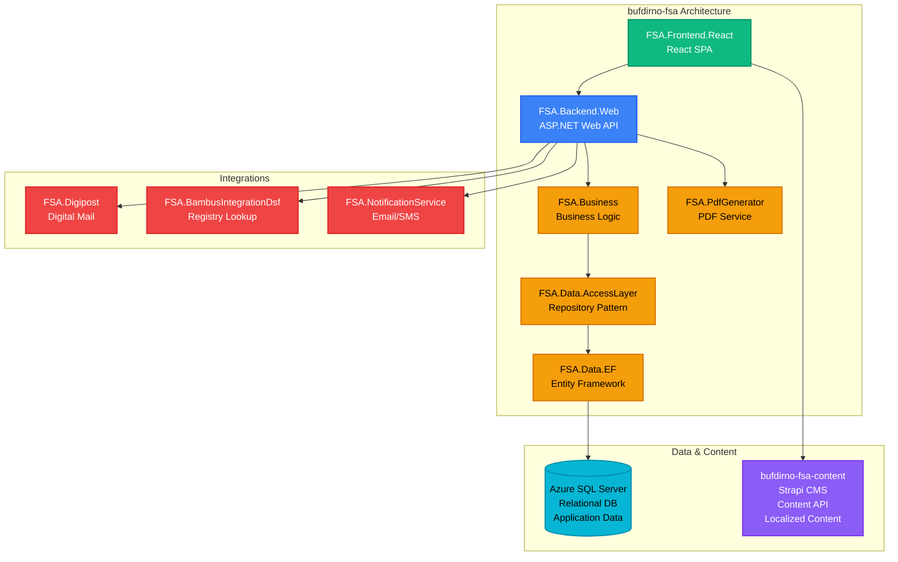

# Family Services Application - bufdirno-fsa

**Stack**: .NET + React
**Repository**: `bufdirno-fsa/`
**Solution File**: `FSA.sln`

Applikasjon for familierådgivningskontorer (Familierådgivningskontor) og sentraladopsjonstjenester (Sentraladopsjon).

**Funksjonalitet**: Tilbyr et omfattende saksbehandlingssystem for familierådgivningskontorer og adopsjonstjenester over hele Norge. Applikasjonen gjør det mulig for sosialarbeidere og rådgivere å opprette, administrere og spore familierådgivningssaker, adopsjonssøknader og relatert dokumentasjon. Viktige funksjoner inkluderer sikre skjemainnsendinger, PDF-generering for saksrapporter og offisielle dokumenter, integrasjon med Digipost for sikker digital dokumentlevering til innbyggere, DSF/Bambus-registeroppslag for å verifisere innbyggerinformasjon, og varslingstjenester for SMS-/e-postvarsler. Systemet håndterer sensitiv personlig informasjon med strenge tilgangskontroller og revisjonslogger, og støtter hele livssyklusen til familierådgivnings- og adopsjonsprosesser fra første søknad til saksavslutning.

**Architecture**:
- `FSA.Backend.Web` - Web API
- `FSA.Business` - Business logic layer
- `FSA.Data.AccessLayer` - Data access layer
- `FSA.Data.EF` - Entity Framework implementation
- `FSA.Frontend.React` - React frontend
- `FSA.PdfGenerator` - PDF generation service
- `FSA.Digipost` - Digital postal integration
- `FSA.NotificationService.Connector` - Notification service integration
- `FSA.BambusIntegrationDsf.Connector` - DSF integration

**Database**: Azure SQL Server (relational database, shared with bufdirno)
- Stores FSA application data: cases, applications, user data, documents
- Entity Framework Core for data access
- Separate schema/tables from main CMS data

**Authentication**: Azure AD (OAuth2)
- User authentication for FSA application
- Role-based access control
- Integration with Azure KeyVault for secrets

**Konfigurasjon / Miljøvariabler**:

| Variabel | Beskrivelse | Kilde |
|----------|-------------|-------|
| `ConnectionStringsFSA` | SQL Server tilkoblingsstreng for FSA-data | KeyVault |
| `InternalResources:ClientId` | Azure AD klient-ID for API-integrasjoner | Config |
| `InternalResources:ClientSecret` | Azure AD hemmelighet | KeyVault |
| `InternalResources:Authority` | Azure AD authority URL | Config |
| `Apis:FrameworkContentApi` | Bufdir.no framework content API URL | Config |
| `Apis:FsaContentApi` | FSA Strapi CMS API URL | Config |
| `StrapiAPIToken` | API token for Strapi CMS | KeyVault |
| `Serilog:WriteTo:SeqSink:Args:apiKey` | Seq logging API-nøkkel | KeyVault |

**Eksterne API-integrasjoner**:

| API | Variabel | Beskrivelse |
|-----|----------|-------------|
| DSF/Bambus | `DsmApi:Url` | DSF/Bambus registerlookup API URL |
| DSF/Bambus | `DsmApi:Scopes` | OAuth2 scope for DSM API |
| Notification | `notification:Url` | Notifikasjonstjeneste URL |
| Notification | `notification:Scopes` | OAuth2 scope for notifikasjoner |
| Digipost | `EpostIntegrationAPI*` | E-postintegrasjon (endpoint, scope, login URL, client ID/secret) |

**Runtime Environment**: Azure App Service (.NET)
- **Deployment**: Azure Pipelines (azure-pipeline.yml)
- **Environments**:
  - **Development**: App Service `fsa-app-dev`
  - **QA**: App Service `fsa-app-qa`
  - **Production**: App Service `bufdir-fsa-app-prod`
  - **Feature**: App Service `fsa-app-feature` (feature branches)
- **CI/CD**: Branch-based deployment (develop → dev, release/* → QA, main → production)
- **Hosting**: Azure App Service
