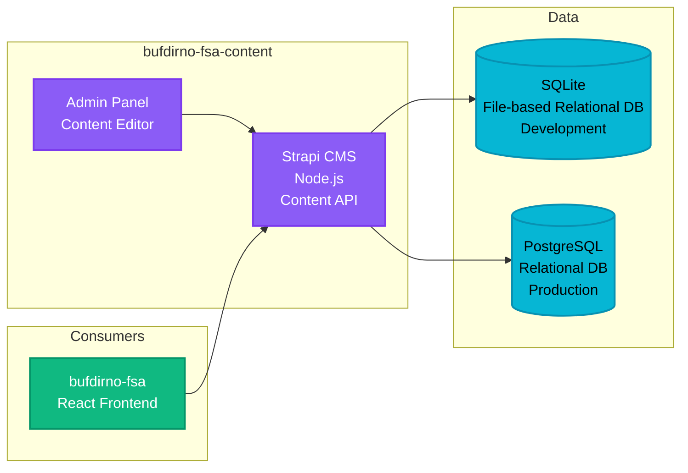

# FSA Content Management - bufdirno-fsa-content

**Stack**: Strapi CMS (Node.js)
**Repository**: `bufdirno-fsa-content/`
**Deployment**: Azure Container App

Headless CMS providing content to the FSA application.

**Funksjonalitet**: Administrerer alt redaksjonelt innhold for Family Services Application gjennom en headless CMS-arkitektur. Innholdsredaktører bruker Strapi admin-panelet for å opprette og vedlikeholde informasjonstekst, hjelpedokumentasjon, skjemaetiketter, veiledningsmeldinger, juridiske ansvarsfraskrivelser og prosessbeskrivelser som vises gjennom hele FSA-applikasjonen. CMS-en tilbyr strukturerte innholdstyper med versjonskontroll og flerspråklig støtte, slik at ikke-teknisk personell kan oppdatere applikasjonsinnhold uten kodeutrullinger. Innhold leveres via REST API til FSA frontend, noe som sikrer konsistent meldingsutveksling på tvers av applikasjonen og muliggjør raske innholdsoppdateringer uavhengig av applikasjonsutrullinger.



**Key Features**:
- Content types with deeply nested components
- Import/Export functionality (`export.tar.gz`)
- Multiple environment configurations (dev, test, qa, prod)
- Docker-based deployment

**Database**:
- Development: SQLite (file-based relational database, lightweight for local development)
- Production: PostgreSQL (relational database for Strapi content types and localized strings)

**Authentication**: None (content API consumed by authenticated FSA application)
- Strapi admin panel protected by Strapi's built-in authentication
- Content API accessed by FSA frontend (no additional authentication layer)

**Konfigurasjon / Miljøvariabler**:

| Variabel | Beskrivelse | Eksempel/Type | Kilde |
|----------|-------------|---------------|-------|
| `DATABASE_CLIENT` | Database type | sqlite/postgres | Config |
| `DATABASE_HOST` | PostgreSQL host | hostname | Config |
| `DATABASE_PORT` | PostgreSQL port | 5432 | Config |
| `DATABASE_NAME` | Database navn | String | Config |
| `DATABASE_USERNAME` | Database bruker | String | KeyVault |
| `DATABASE_PASSWORD` | Database passord | Secret | KeyVault |
| `DATABASE_SSL` | SSL-tilkobling enabled | true/false | Config |
| `APP_KEYS` | Strapi applikasjonsnøkler (kommaseparert) | Secret | KeyVault |
| `ADMIN_JWT_SECRET` | JWT secret for admin-panel | Secret | KeyVault |
| `API_TOKEN_SALT` | Salt for API tokens | Secret | KeyVault |
| `JWT_SECRET` | JWT secret for autentisering | Secret | KeyVault |
| `TRANSFER_TOKEN_SALT` | Salt for transfer tokens | Secret | KeyVault |

**Runtime Environment**: Azure Container App (Node.js)
- **Deployment**: Azure Pipelines (azure-pipeline.yml) + Docker
- **Environments**: Test (develop), QA (release/*), Production (main)
- **Azure Resources**:
  - Container Apps use variable groups: `fsa-content-test`, `fsa-content-qa`, `fsa-content-prod`
  - Resource names configured per environment in pipeline variable groups
- **CI/CD**: Docker image build and push to Azure Container Registry
- **Hosting**: Azure Container App with environment-specific Dockerfiles (Dockerfile-dev, -test, -qa, -prod)
- **Docker Compose**: Available for local development

**Development**:
```bash
npm install
npm run develop
npm run import  # Import content from export.tar.gz
```
