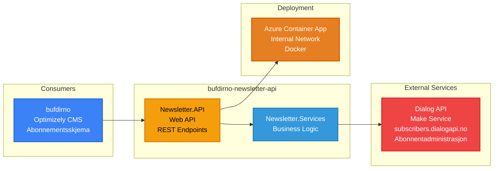

# Nyhetsbrev API - bufdirno-newsletter-api

**Stack**: .NET API
**Repository**: `bufdirno-newsletter-api/`
**Solution File**: `Bufdir.Newsletter.API.sln` (in src/)

API for nyhetsbrevabonnementer og administrasjon.

**Funksjonalitet**: Håndterer e-postnyhetsbrevabonnementer og preferanseadministrasjon for Bufdir.no-kommunikasjon gjennom integrasjon med Dialog API (Make-tjenesten). API-et tilbyr REST-endepunkter for brukere til å abonnere på ulike nyhetsbrevtemaer (barnevernoppdateringer, fosterhjemsinformasjon, nyheter om familietjenester osv.), administrere abonnementspreferanser og melde seg av e-postlister. Tjenesten fungerer som et integrasjonslag og proxyer forespørsler til Dialog/Make API på subscribers.dialogapi.no, som administrerer de faktiske abonnentdataene, e-postlister og e-postlevering. Utplassert på et internt Azure Container App-nettverk, nås API-et eksklusivt av bufdirno-portalen, noe som gir sikkerhet på nettverksnivå uten å kreve OAuth2-autentisering.

**Konfigurasjon / Miljøvariabler**:
- `Services:ActiveService` - Aktivt tjeneste-navn (Make)
- `Services:Make:BaseUrl` - Dialog API base URL (https://subscribers.dialogapi.no)
- `Services:Make:HttpClientName` - HTTP klient navn for dependency injection
- `Services:Make:ApiKey` - API-nøkkel for Dialog/Make autentisering
- `Services:Make:UserId` - Bruker-ID for Dialog/Make API
- `AzureAd:Instance` - Azure AD instance URL (kun for eventuell fremtidig autentisering)
- `AzureAd:ClientId` - Azure AD applikasjons-ID
- `AzureAd:TenantId` - Azure AD tenant ID

**Projects**:
- `Bufdir.Newsletter.API` - Web API
- `Bufdir.Newsletter.Services` - Service layer

**Database**: None (uses external API)
- No local database - acts as integration layer/proxy
- Integrates with Dialog API (Make service) at https://subscribers.dialogapi.no
- Dialog API endpoints:
  - POST `/api/public/v2/subscribers` - Create subscriber
  - GET `/api/public/v2/subscriberlists/{id}` - Get mailing list info
  - GET `/api/public/v2/subscriberlists/` - List all mailing lists
- All subscriber data stored and managed by Dialog/Make service

**Authentication**: None (internal network only)
- Deployed on internal Azure Container App network
- No OAuth2 scopes configured
- Accessed only by bufdirno within Azure internal network
- Network-level isolation provides security

**Runtime Environment**: Azure Container App (.NET)
- **Deployment**: Azure Pipelines (azure-pipelines.yml) + Docker
- **Environments**:
  - **Test**: Container App `ca-newsletter-api`
  - **QA**: Container App `ca-newsletter-api-qa`
  - **Production**: Container App `ca-newsletter-api-prod`
- **URLs** (internal only):
  - Test: https://ca-newsletter-api.internal.mangomushroom-fdb9af6c.norwayeast.azurecontainerapps.io
  - QA: https://ca-newsletter-api-qa.internal.politecliff-01597c12.norwayeast.azurecontainerapps.io
  - Production: https://ca-newsletter-api-prod.internal.bluemoss-72d501a7.norwayeast.azurecontainerapps.io
- **CI/CD**: Docker build with NuGet PAT, push to ACR, deploy to Container App
- **Hosting**: Azure Container App (internal network)
- **Network**: Internal-only, not exposed to public internet
- **Branches**: develop, release/*, main, hotfix/*
