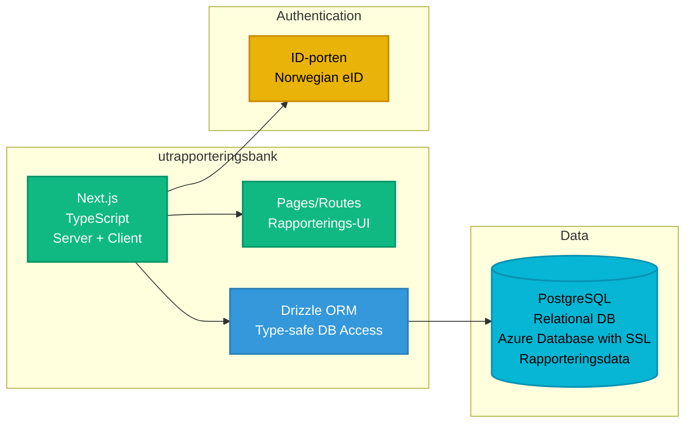

# Utrapporteringsbank - utrapporteringsbank

**Stack**: Next.js (TypeScript)
**Repository**: `utrapporteringsbank/`

Rapporteringsapplikasjon bygget med Next.js.

**Funksjonalitet**: Tilbyr et sikkert rapporteringssystem for autoriserte brukere til å sende inn og administrere institusjonelle rapporter relatert til barnevern og familietjenester. Applikasjonen bruker ID-porten for sterk autentisering via norske nasjonale eID-tjenester (BankID, MinID), noe som sikrer at bare autorisert personell kan få tilgang til rapporteringsgrensesnittet. Brukere kan opprette, redigere og sende inn strukturerte rapporter med skjemavalidering og datapersistens håndtert gjennom Drizzle ORM med PostgreSQL. Systemet opprettholder omfattende revisjonslogger over rapportinnsendinger, endringer og tilgangsmønstre for etterlevelse og ansvarlighet. Next.js server-side rendering sikrer optimal ytelse samtidig som sensitiv data håndteres sikkert, med SSL-krypterte databasetilkoblinger til Azure Database for PostgreSQL. Rapporteringsarbeidsflyten støtter utkastlagring, gjennomgangsprosesser og endelig innsending med bekreftelsesmeldinger.

**Konfigurasjon / Miljøvariabler**:

**Database Konfigurasjon**:

| Variabel | Beskrivelse | Kilde |
|----------|-------------|-------|
| `DB_HOST` | PostgreSQL server host | Config |
| `DB_PORT` | PostgreSQL server port | Config |
| `DB_USER` | Database brukernavn | KeyVault |
| `DB_PASSWORD` | Database passord | KeyVault |
| `DB_NAME` | Database navn | Config |

**ID-porten Autentisering** (Norsk eID):

| Variabel | Beskrivelse | Kilde |
|----------|-------------|-------|
| `NEXT_PUBLIC_IDPORTEN_WELLKNOWN_URL` | ID-porten OpenID Connect discovery URL | Config |
| `NEXT_PUBLIC_IDPORTEN_LOGOUT_URL` | ID-porten logout URL | Config |
| `IDPORTEN_CLIENT_ID` | ID-porten klient-ID for OAuth2 | Config |
| `IDPORTEN_CLIENT_SECRET` | ID-porten klient-hemmelighet | KeyVault |

**Azure AD Autentisering** (Internt personell):

| Variabel | Beskrivelse | Kilde |
|----------|-------------|-------|
| `AZURE_CLIENT_ID` | Azure AD applikasjons-ID | Config |
| `AZURE_CLIENT_SECRET` | Azure AD hemmelighet | KeyVault |
| `AZURE_TENANT_ID` | Azure AD tenant ID | Config |

**NextAuth Konfigurasjon**:

| Variabel | Beskrivelse | Kilde |
|----------|-------------|-------|
| `NEXTAUTH_URL` | NextAuth callback URL | Config |
| `NEXTAUTH_SECRET` | NextAuth session krypteringsnøkkel | KeyVault |



**Database**: PostgreSQL (Azure Database for PostgreSQL with SSL)

**Authentication**: ID-porten (Norwegian national eID service)
- OAuth2/OpenID Connect integration
- Production: `https://idporten.no/.well-known/openid-configuration`
- Test: `https://test.idporten.no/.well-known/openid-configuration`
- Used for Norwegian citizen authentication (BankID, MinID, etc.)
- Provides secure user identity verification

**Runtime Environment**: Azure Container App or Azure App Service (Node.js)
- **Deployment**: Azure Pipelines (azure-pipelines.yml)
- **Environments**: Development, Test, QA, Production
  - Azure resource names configured in pipeline
- **CI/CD**: Next.js build and deployment
- **Hosting**: Likely Azure Container App or Azure App Service
- **Port**: 6000 (development)
- **Framework**: Next.js (Server-Side Rendering + API Routes)

**Development**:
```bash
npm run dev  # Runs on http://localhost:6000
```

**Key Technologies**:
- Next.js
- Drizzle ORM (`drizzle.config.ts`) - Type-safe PostgreSQL access
- TypeScript
- ID-porten integration
